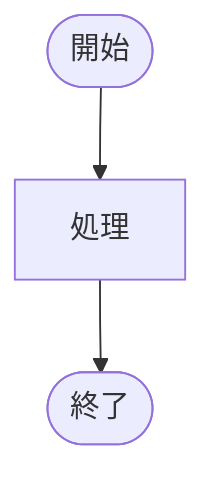

# Zenn Writer Skill

このスキルは、Komekamiの文体ガイドラインに基づいてZenn技術ブログ記事を作成します。

## 主な機能

1. **箇条書きメモから記事化**（主要ユースケース）
   - ユーザーが提供したメモや箇条書きを、完全な記事に変換
2. **論文URLから論文メモ作成**
   - arXivなどの論文URLから、論文メモ形式の記事を生成
3. **既存記事のリライト**
   - articles/内の既存ファイルをKomekami文体に修正
4. **Notionページ群から記事化**
   - 複数のNotionページのコンテンツを統合し、1本のZenn記事を生成

## ワークフロー

### Step 1: 入力の確認と記事タイプの判定

ユーザーの入力から以下を判定する：

- **記事タイプ**：技術解説 / 振り返り / 論文メモ
  - 実装・技術的な内容 → 技術解説
  - Keep/Problem/Try、KPT形式があれば → 振り返り
  - 論文URL（arxiv.org, ACL anthology等）があれば → 論文メモ
  - 判定が難しい場合はユーザーに確認

- **入力タイプ**：
  - 箇条書きメモ
  - 論文URL
  - 既存ファイルパス（articles/以下）
  - NotionページURL / ページID（複数可）→ **ワークフロー4**へ

### Step 2: 必要な情報の収集

**論文URLからの記事化の場合**：
- WebFetchで論文を取得し、内容を読み込む
- 論文の構造（Abstract, Introduction, Method, Results, Conclusion等）を把握

**既存ファイルのリライトの場合**：
- Readツールで既存ファイルを読み込む
- 既存の構成と内容を理解

**メモからの記事化の場合**：
- ユーザーが提供したメモの内容を分析
- 不足している情報があれば質問

### Step 3: ファイル名の生成

記事の内容から、適切なファイル名を自動生成する：

- 英小文字とハイフンのみ使用
- 内容を簡潔に表現（例：`vertex-ai-workbench-auto-start.md`, `recsys-2025.md`）
- 既存ファイルとの重複をチェック（articles/ディレクトリをGlobで確認）
- 同名ファイルがある場合は、上書き確認またはファイル名の変更を提案

### Step 4: frontmatterの候補提示

以下の項目について候補を提示し、ユーザーに選んでもらう：

```yaml
---
title: "記事タイトル（簡潔で分かりやすく）"
emoji: "📚"  # 候補を3つ程度提示
type: "tech"
topics: ["python", "gcp", "機械学習"]  # 候補を提示（3-5個）
published: true
publication_name: "dmmdata"  # 組織投稿の場合のみ
---
```

**emoji候補の選び方**：記事内容に関連性のあるものを選ぶ
**topics候補の選び方**：技術スタック、フレームワーク、主要概念から選ぶ

### Step 5: 記事本文の執筆

選択された記事タイプに応じたテンプレートを使用し、Komekamiの文体ガイドラインに従って執筆する。

### Step 6: ファイルの保存

- `/home/tomoya/zenn-docs/articles/[生成されたファイル名].md` に保存
- 既存ファイルがある場合は上書き前に確認

---

## ワークフロー4: Notionページ群 → Zenn記事

**トリガー**: ユーザーが `notion.so/` を含むURL、または `notion.so/` ページIDを複数提供したとき

### Step N1: Notionページのコンテンツ取得

各ページについて以下のMCPツールを呼び出す：

1. **ページメタデータの取得**（タイトル・プロパティ確認）
   - MCPツール: `notion_retrieve_a_page`（page_id引数にNotionページIDを渡す）
   - NotionページURLからIDを抽出する方法：`https://www.notion.so/[workspace]/[title]-[PAGE_ID]` の末尾32文字

2. **ページ本文ブロックの取得**
   - MCPツール: `notion_retrieve_block_children`（block_id引数に同じページIDを渡す）
   - ネストされたブロック（toggle内、callout内など）は再帰的に取得が必要な場合あり

### Step N2: Notionブロック → コンテンツの解釈

取得したブロックを以下のルールでMarkdownコンテンツとして解釈する：

| Notionブロックタイプ | 解釈 |
|---|---|
| `paragraph` | テキスト段落 |
| `heading_1` / `heading_2` / `heading_3` | 見出し（内容に応じてZenn記事の見出し階層に変換） |
| `bulleted_list_item` | ハイフン箇条書き（-） |
| `numbered_list_item` | 番号付きリスト |
| `code` | コードブロック（言語指定付き）|
| `quote` | 引用（>）|
| `callout` | :::message ブロック |
| `toggle` | :::details ブロック |
| `image` | 画像URL（外部参照として扱う）|
| `divider` | セクション区切りとして認識 |
| `table` / `table_row` | Markdownテーブルに変換 |

### Step N3: 複数ページのコンテンツ統合

- 全ページの内容を読み込んだ後、論理的な順序に整理
- 記事タイプを判定（技術解説 / 振り返り / 論文メモ）
- 重複・冗長な情報を除去
- ページ間の矛盾点はユーザーに確認（または両方の観点を記載）

### Step N4: Zenn記事として執筆

通常のワークフロー（Step 3〜6）に従い、以下を実施：
- ファイル名生成
- frontmatter候補の提示（emoji, topics）
- 記事テンプレートに従った執筆（Komekami文体）
- `articles/` への保存

---

## 記事タイプ別テンプレート

### 1. 技術解説・実装系記事

```markdown
## はじめに
背景・動機をリスト形式で簡潔に記述。

## 概要（または「概観」）
記事で扱う内容の全体像を説明。

## [メインコンテンツ]
- 段階的な説明
- 図表（Mermaid、画像）を効果的に活用
- コードブロックを適切に配置
- 見出しを適切に階層化（##, ###, ####）

## おわりに
- 学びや感想を「システム面」「ロジック面」など観点別に整理
- 今後の展望や改善点を具体的に記述

## 参考（または「参考文献」）
- 参考にした資料のリスト
```

**実例参考**：x-recommendation-algorithm.md, grok-based-transformer-tuning.md

### 2. 振り返り・まとめ系記事

```markdown
## はじめに
背景・概要説明。イベント情報があれば記載。

## 課題
- 取り組む前の状態や問題点を明確に記述

## 取り組んだ内容
### [具体的な施策1]
### [具体的な施策2]

## 効果検証
### オフライン評価
- 評価指標の定義
- 結果の提示（表形式）

### A/Bテスト
- 結果の提示（表形式）
- 考察

## まとめ
全体的な成果と学びを振り返る。

## 今後の展望
- 改善策や今後の取り組みを具体的に列挙

## おわりに
- 関連イベントや過去記事への誘導（該当する場合）

## 参考
- 参考資料
```

**実例参考**：strategic-search-rec-3.md

### 3. 論文メモ系記事

```markdown
## [論文タイトル]
- 論文URL: 
- 会議: 
- （GitHub: ）

### 読む動機
- 具体的で率直な動機を箇条書きで記述

### 要約
3-5行程度で論文の内容を簡潔にまとめる。

### 背景
- 問題設定
- 既存手法の課題

### 提案手法
- 数式やアーキテクチャの詳細説明
- 図表を効果的に活用

### 有効性
- 実験結果
- 性能評価

### 感想
率直な感想と今後への展望を記述。

### 参考
- 関連リンク
```

---

## Komekami文体ガイドライン

### 基本的な語り口
- 丁寧語（です・ます調）で一貫
- 親しみやすく、読者に語りかけるような口調
- 専門的な内容も分かりやすく噛み砕く
- 堅苦しくない、自然な文体

### 好ましい表現パターン

**客観的な説明**：
- 「〜ことがわかります」
- 「〜ことが確認できました」
- 「〜という工夫をしていることがわかります」
- 「〜と考えられます」
- 「〜が見られます」

**素直な感想・学び**：
- 「〜ということがわかった」
- 「〜と思った」「〜ではないかと思います」
- 「〜が印象的だった」
- 「理解が深まった」「勉強になりました」
- 「個人的には〜と思いました」

**学習・成長への意欲**：
- 「次は〜を学んでいきたい」
- 「今後も〜していきたい」「今後検証していきたいです」
- 「〜について調べてみる」

**実務との繋がり**：
- 「弊チームでも〜運用している」
- 「〜の観点からも大きな成果でした」

### 具体的な文体例（好ましい）
- 「〜について調べていたので、まとめようと思います」
- 「〜を読んでみると、得心のいくことが多く理解が深まりました」
- 「〜は知っていたのですが、実際に使われていて驚きました」
- 「〜あたりの話がよくわからなかった」（率直な不理解の表明）
- 「軽くお気持ち実装してみようかなと思いました」
- 「〜ではないかと思います」（推測の表現）

### 避けるべき表現
- 過度にカジュアルな表現
- 断定的すぎる表現（「〜である」より「〜だと思います」「〜と考えられます」）
- 冗長な前置き
- 絵文字の多用（frontmatter以外には使用しない）

### 段落・見出しの使い方
- 見出しは階層を明確に（##, ###, ####を適切に使用）
- 1段落は簡潔に（3-5行程度）
- 箇条書きを積極的に活用

### 専門用語の扱い
- 初出時は説明を併記
- 略語は正式名称→略語の順で記載（例：「GQA (Grouped Query Attention)」）
- 背景知識が必要な概念は丁寧に説明

---

## コードや数式の扱い

### コードブロック
- 言語指定を必須（```python, ```bash, ```rust など）
- ファイル名を明記する場合は ` ```python: ファイル名.py ` 形式
- コメントを適切に記載
- 長いコードは :::details で折りたたみ可能にする

**例**：
````markdown
:::details コード例
```python
class RotaryPositionEmbedding(nn.Module):
    def __init__(self, dim: int, max_seq_len: int = 512):
        super().__init__()
        # 実装...
```
:::
````

### 数式
- LaTeX記法で記述（$inline$ または $$display$$）
- 変数の説明を併記
- 数式の意味を文章で補足説明

**例**：
```markdown
RMSNorm は平均 $\mu$ を計算せず、RMS のみで正規化します。

$$
\bar{a}_i = \frac{a_i}{\text{RMS}(a)} g_i
$$

ここで $g_i$ は学習可能なゲインパラメータです。
```

### 図表
- Mermaidフローチャートを積極的に活用
- 画像は `/images/記事スラッグ/` 配下に配置
- 図表には説明キャプション（*説明文*）を付ける
- 表は Markdown table 形式で記述

**Mermaid例**：
````markdown

````

**画像例**：
```markdown

*Two-Tower モデルの一般的な構成図[^2]*
```

---

## Zenn独自記法の活用

### メッセージブロック
補足情報や注意事項の記述に使用：

```markdown
:::message
公開リポジトリには、推論コードのみが含まれており、学習コードは含まれていませんでした。
詳細な目的関数や NegativeSampling 手法などがわからないので残念。。。
:::
```

### 詳細の折りたたみ
長いコードや補足説明を折りたたむ：

```markdown
:::details コード例
```python
# 長いコード...
```
:::
```

### アコーディオン（見出し付き折りたたみ）
```markdown
:::details タイトル
内容
:::
```

---

## 文体・書式のスタイル

### 強調（Bold）
- **最小限に留める**
- 過度な強調を避け、自然な読みやすさを重視
- 見出し語や絶対に必要な箇所のみに使用（例：「**Multi-task 学習**」）

### リスト項目
- **ハイフン（-）で統一**
- アスタリスク（*）は使用しない
- ネストしたリストも含めて一貫性を保つ

### 実務寄りの表現
- 「こう使うと便利」「落とし穴 / 罠」「パフォーマンスTips」など実用的な観点
- 課題→分析→改善→検証という流れを明確に

---

## 実験・検証の記述パターン

技術記事で実験結果を記載する場合：

### 評価指標の定義
まず評価指標を明確に定義する：

```markdown
### 評価指標

- **Recall@100**: 正解アイテムのうち、上位100件に含まれるものの割合
- **nDCG@100**: 上位100件のランキング品質を測る指標
```

### 結果の提示
表形式で明確に提示：

```markdown
### 結果

| variant | Δ Recall@100 | Δ nDCG@100 |
|---|---|---|
| baseline | — | — |
| w/ RMSNorm | ±0.00% | ±0.00% |
| w/ RoPE | +8.33% | +3.06% |
```

### 考察
結果の解釈を記述：

```markdown
### 考察

RoPE を追加した段階で Recall@100 が 8.33% 上昇しており、明確な改善が見られました。
〜という相対位置情報が効いていると考えられます。
```

---

## 記事の始め方・終わり方

### 記事の導入

**「はじめに」セクション**：
- 背景・動機を箇条書きで明確に
- 「〜について学びたい」「〜に興味を持った」など学習動機を率直に
- イベント登壇記事の場合はイベント情報を記載

**例**：
```markdown
## はじめに

2026年1月、X のレコメンドアルゴリズムが公開されました。

https://github.com/xai-org/x-algorithm

この記事では、公開されたコードを読んで以下の点について理解を深めようと思います。

- X のレコメンドシステム全体のアーキテクチャ
- 候補生成とランキングの2段階構成の実装
```

### 記事の結び

**「おわりに」セクション**：
- 「〜ができてよかった」「理解が深まった」など素直な達成感
- 「今後は〜していきたい」など前向きな今後の展望
- 「〜が面白かった」「〜を試してみたい」など知的好奇心の表現
- 観点別（システム面・ロジック面など）に整理することも効果的

**例**：
```markdown
## おわりに

### システム面
X のレコメンドシステムはリアルタイム推論でのレイテンシを抑えるための工夫が随所に見られて、勉強になりました。

### ロジック面
Transformer を用いてユーザ行動履歴をエンコードするのは、最近のレコメンドシステムでよく見かける気がします。
```

---

## 技術記事特有の工夫

### コード例の書き方
- ファイル名を明記（例：`docker-compose.yml`）
- 変更点はdiff形式で表示も検討
- 実行例・出力例を併記

**例**：
```python
# example.py
def calculate_similarity(vec1, vec2):
    return np.dot(vec1, vec2) / (np.linalg.norm(vec1) * np.linalg.norm(vec2))
```

### 注意点の書き方
- 重要な注意事項は :::message で明確に
- つまずきやすいポイントを事前に説明
- 代替案や解決策も併せて提示
- 「。。。」で残念さや未完了を表現

**例**：
```markdown
:::message
GQA は今回は未検証です。（時間がなかった。。）
推論速度やメモリ効率の観点で効果が期待できるため、今後検証予定です。
:::
```

---

## 学習・成長マインドセットの表現

記事を通じて以下のような姿勢を表現する：
- 継続的な学習への意欲
- 試行錯誤を恐れない姿勢
- 知らないことを素直に認める謙虚さ
- 新しい技術への好奇心
- 実践を通じた学びを重視
- 実務での活用を見据えた視点

---

## 注意事項

1. **絵文字は使わない**：本文中に絵文字を含めない（frontmatterのemojiフィールドのみ）
2. **リストはハイフン（-）のみ**：アスタリスク（*）は使用しない
3. **強調は最小限**：必要な箇所のみBoldを使用
4. **ファイル保存前の確認**：
   - 生成されたファイル名をユーザーに確認
   - frontmatter候補（emoji, topics）をユーザーに選択してもらう
   - 既存ファイルがある場合は上書き確認
5. **記事の完成度**：
   - 構造が明確で読みやすい
   - コードブロックは適切にフォーマット
   - リンクや参考文献は正確に記載
   - 図表は効果的に配置
6. **脚注の活用**：
   - 参考文献は脚注形式（[^1], [^2]）で記載可能
   - 記事末尾に脚注定義を配置
