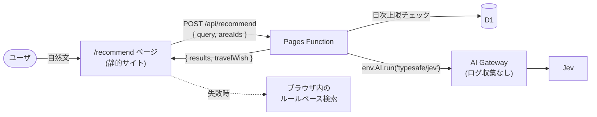

## はじめに

個人開発で、漫画『ざつ旅 -That's Journey-』の聖地巡礼を支援する Web アプリを作っています。作中に登場するエリアやスポットを地図で探したり、ルーレットで旅先を決めたりできるアプリで、Next.js の静的エクスポートを Cloudflare Pages に置いて運用しています。

今回、「温泉でのんびりしたい」のような自然文の希望から、合いそうなエリアを提示するレコメンド機能を追加しました。
スコアリングには TypeSafe AI の Jev という、テキストを生成せず型付きの判定と確率だけを返すモデルを使っています。

この記事では、完全な静的サイトだったアプリに、AI API を呼ぶ機能を1つだけ組み込むときに考えたことをまとめようと思います。

- Cloudflare Workers AI 経由で Jev を呼ぶときのハマりどころ
- 費用が青天井にならないための上限管理
- 入力文を残さないためのプライバシー対策
- API が使えなくても壊れない画面（フォールバック）とテスト

:::message
Jev の質問設計（criteria の書き方）や精度評価など、レコメンドのロジック側については別記事にまとめています。
TODO: 別記事のリンクを貼る
:::

## 構成


*レコメンド機能の全体構成*

- アプリ本体は静的エクスポートのままで、`/api/recommend` だけを Pages Function（`functions/api/recommend.ts`）として追加しています
- ブラウザは、ユーザのネタバレ設定で表示してよいエリアの ID（`areaIds`）と自然文（`query`）だけを送ります
- Function はエリアごとの質問を組み立てて Jev を1回だけ呼び、`{ results: [{ areaId, score, confidence }], travelWish }` だけを返します
- エリア名や説明文は返さず、表示はクライアント側の静的データから行います
- 画面では、スコア（0〜1）を★1〜5 の「おすすめ度」に変換して表示します。スコアは確率ではないので、「%」表示は避けました

### Function にバンドルするデータを小さくする

Jev に渡すエリアの情報（エリアプロファイル）は、ビルド時に生成した JSON（`src/data/area-profiles.json`）をコミットしておき、Function からはそれだけを import しています。
元のスポットデータ（`spots.json`）は 1.3MB あるので、Function にバンドルしたくなかったためです。

生成物をコミットすると再生成漏れが心配になりますが、Vitest で「元データから再生成した結果とコミット済みの JSON が一致すること」を検証しているので、データ更新時に気づけるようになっています。

### ネタバレを含めない

このアプリには「何話まで読んだか」のネタバレ設定があり、未読のエリアやスポットは完全に隠しています。レコメンドでも同じ規則を守る必要があります。

- ブラウザ側で、ネタバレ設定上見えているエリアの ID だけを `areaIds` として送る（見えないエリアはリクエストにも結果にも含まれない）
- エリアプロファイルには、エリアの初登場より後に初登場するスポットの情報を含めない

2つ目の規則にしておくと、「エリアが見えている ⇔ そのエリアの初登場話まで読んでいる」なので、プロファイルはユーザのネタバレ設定によらず常に安全に使えます。ユーザごとにプロファイルを作り分ける必要がなくなり、事前生成の JSON 1つで済んでいます。

## Workers AI 経由で Jev を呼ぶ

### 直 API から Workers AI に切り替えた理由

当初は TypeSafe の API を直接呼び、API キーを Pages の secret に置く予定でした。Workers AI 経由（モデル ID `typesafe/jev`）も選べましたが、当時は料金や無料枠が公式に明記されておらず、コストの見通しが立たないので見送っていました。

その後、状況が変わりました。

- TypeSafe が需要急増で新規登録を一時停止し（waitlist 承認制）、API キーの入手が不安定になった
- Cloudflare のダッシュボードに `typesafe/jev` の料金が明示された（直 API と同額、Zero data retention の表示あり）
- Workers AI のバインディング（`env.AI`）経由なら API キーが要らず、D1 と同じく Pages の Bindings 設定だけで済む

秘密情報・設定・請求を Cloudflare に一元化できるので、Workers AI 経由に切り替えました。

```ts:functions/api/recommend.ts（簡略化）
let timeoutId: ReturnType<typeof setTimeout> | undefined;
try {
  const timeout = new Promise<never>((_, reject) => {
    timeoutId = setTimeout(() => reject(new Error("timeout")), JEV_TIMEOUT_MS);
  });
  result = await Promise.race([
    ai.run(
      "typesafe/jev",
      { state: { request: query }, questions },
      { gateway: { id: "default", collectLog: false } },
    ),
    timeout,
  ]);
} catch {
  // タイムアウト・例外。ユーザの入力文はログに出さない
  return jsonResponse({ error: "upstream_error" }, 502);
} finally {
  clearTimeout(timeoutId);
}
```

`env.AI.run` が `AbortSignal` を受け取る保証がなかったので、タイムアウト（5秒）は `Promise.race` で実装しています。

### ハマりどころ

#### サードパーティモデルは AI Gateway が必須

最初はゲートウェイを指定せずに `env.AI.run("typesafe/jev", ...)` を呼んでいたのですが、Preview デプロイで 502 になりました。
ドキュメントを確認すると、`typesafe/jev` はサードパーティモデルに分類されていて、「Third-party models require an AI Gateway and use Unified Billing.」とありました[^1]。

- 第3引数で `{ gateway: { id } }` を指定する必要がある
- 費用は Unified Billing の前払いクレジットから引かれる（購入時に 5% の手数料）
- Workers AI の無料枠（10,000 Neurons/日）の対象外

ゲートウェイ ID には `default` を指定しています。初回の呼び出しでアカウントに自動作成される既定のゲートウェイなので、事前に作成・命名する手順を省けます。
前払いなので、自動チャージを設定しない限り残高を超えて請求されることはありません。クレジットが尽きた場合は呼び出しが失敗し、後述のフォールバックに切り替わります。

#### AI Gateway は既定でプロンプトをログに保存する

AI Gateway は既定でリクエストのログ（プロンプトとレスポンスの本文を含む）を保存します[^2]。
このアプリでは「入力した文章を保存・ログ出力しない」と About ページで説明しているので、呼び出しごとに `collectLog: false` を指定してログ収集を止めています。ダッシュボードの設定に頼らず、コードで保証できるのが良いところです。

#### 戻り値が `result` に包まれて返ってくる

直 API の応答は `{ model, answers, usage }` の形ですが、AI Gateway 経由だと `{ state, result: { model, answers, usage }, gatewayMetadata }` と本体が `result` に包まれて返ってきました。
Preview で一時的に診断ログを入れて形を確認し、包まれていない形も受け付ける純粋関数で本体を取り出すようにしました。

```ts:src/lib/recommend.ts
export function extractJevResponse(raw: unknown): JevResponseBody | null {
  if (!isPlainObject(raw)) return null;
  const body = isPlainObject(raw.result) && isPlainObject(raw.result.answers) ? raw.result : raw;
  if (!isPlainObject(body.answers)) return null;
  return {
    model: typeof body.model === "string" ? body.model : undefined,
    answers: body.answers as Record<string, JevAnswerLike>,
    usage: isPlainObject(body.usage) ? (body.usage as JevResponseBody["usage"]) : undefined,
  };
}
```

#### モデルのバージョンを固定できない

Workers AI 側のモデル ID は `typesafe/jev` だけで、バージョン（`jev-1.13.0` など）は指定できず、`jev-latest` 相当に追随します。
質問の設計やしきい値は `jev-1.13.0` で調整したものなので、TypeSafe が新バージョンを告知したときに評価スクリプトを再実行する運用にしました（スクリプトは観測した `model` 名も出力します）。バージョンの変化を Function で自動検知する仕組みまでは入れていません。

#### wrangler の設定ファイルを置かない構成

このリポジトリには `wrangler.toml` を置かない方針にしているので、バインディングはすべて Cloudflare Pages のダッシュボード（Settings → Bindings）で設定しています。

| バインディング | 種類 | 用途 |
|---|---|---|
| `AI` | Workers AI | Jev の呼び出し |
| `RECOMMEND_DB` | D1 | 日次上限のカウンタ |

Production と Preview の両方に設定し、どちらかが未設定なら Function は Jev を呼ばずに 503 を返します。

D1 のテーブル作成も `wrangler d1 migrations apply` ではなく、`wrangler d1 execute --remote --file` で SQL を直接流しています。`migrations apply` や `execute --local` は設定ファイルがないと失敗するためです。
その代わりローカルで D1 込みの動作確認ができないので、動作確認は Preview デプロイで行っています。

:::message
`npx wrangler pages dev out --ai AI` でローカルから Workers AI バインディングを渡すこともできますが、実際の Workers AI が呼ばれて使用量が計上されます。
また、wrangler のローカル実行エンジン（workerd）は glibc 2.35 以上を要求するので、Ubuntu 20.04 の WSL2 では `wrangler pages dev` 自体が起動しませんでした。。。
:::

## 費用の上限を守る

1検索あたりの費用は設計時の見積もりで約 $0.0006〜0.0008（入力 約1.5〜2万トークン）と小さいですが、公開サービスなので連打や不正利用で費用が膨らむのは避けたいところです。
対策は役割ごとに分けて重ねています。

| 対策 | 役割 |
|---|---|
| 入力長の上限（200文字）・送信ボタン押下時のみ呼ぶ | 無駄な呼び出しを減らす |
| Cache API で同一リクエストを5分キャッシュ | 同じ検索の再課金を防ぐ |
| Cloudflare WAF のレート制限 | IP 単位の短時間の連打を抑える |
| D1 の日次カウンタ（1日3,000回まで） | サイト全体の費用の上限 |
| AI Gateway の支出上限・前払いクレジット | 最後の歯止め |

日次上限の3,000回は、手数料込みで最大 約$60〜80/月に相当します。

### D1 で「上限未満のときだけ +1」

日次カウンタは D1（SQLite）に置き、1文の SQL で「上限未満のときだけ +1」を原子的に行っています。

```sql:migrations/0001_daily_usage.sql
CREATE TABLE IF NOT EXISTS daily_usage (
  day TEXT PRIMARY KEY,
  count INTEGER NOT NULL
);
```

```ts:functions/api/recommend.ts
const row = await env.RECOMMEND_DB.prepare(
  "INSERT INTO daily_usage(day, count) VALUES(?1, 1) " +
    "ON CONFLICT(day) DO UPDATE SET count = count + 1 WHERE count < ?2 RETURNING count",
)
  .bind(utcDayKey(new Date()), dailyLimit)
  .first<D1Result>();
if (!row) {
  return jsonResponse({ error: "daily_limit_reached" }, 429);
}
```

- その日の行がなければ `INSERT` で1を入れる
- 行があって上限未満なら `DO UPDATE` で +1 し、`RETURNING` で新しいカウントを返す
- 上限に達していると `DO UPDATE` の `WHERE` が偽になり、更新も `RETURNING` も行われない（= 行が返らない）

行が返らないことを上限超過とみなしているので、上限到達後にいくら連打されても D1 の書き込み枠（無料プランで 10万行/日）を消費しないのが地味に嬉しいところです。
KV も検討しましたが、無料枠の書き込みが 1,000回/日で、原子的な加算もできないので D1 を選びました。

数え方のルールは次のようにしています。

- 数えるのは Jev を実際に呼ぶ直前（キャッシュヒットは数えない）
- Jev の呼び出しが失敗した回も数える（費用側に安全に倒す）
- 日付の区切りは UTC 0:00（日本時間 9:00）
- D1 のバインディングが未設定・エラーの場合は Jev を呼ばずに 503 を返す（上限を確認できない状態で課金を発生させない）

### WAF のレート制限は無料プランの制約に注意

IP 単位の連打対策には Cloudflare WAF のレート制限ルールを使っています。ただ、無料プランでは次の制約がありました（2026年9月時点）。

- ルールは1件まで
- 集計期間は10秒固定（「10リクエスト/分」のような設定はできない）
- 超過時のブロック期間も10秒固定
- マッチ条件は Path などに限られ、集計単位は IP アドレスのみ

`/api/recommend` に「10秒あたり10リクエスト程度」のルールを設定し、短時間の連打は WAF、1日の費用の上限は D1 と役割を分けています。

## 入力文を残さない

ユーザの入力文は Cloudflare を経由して TypeSafe のモデルに送られます。About ページでそのことを明示したうえで、サーバー側には入力文を残さないようにしています。

- AI Gateway のログ収集を `collectLog: false` で止める
- Function のエラー処理でも入力文をログに出さない
- Cache API のキャッシュキーには、入力文を平文ではなく SHA-256 ハッシュにして使う（キャッシュはエッジに残るため）

```ts:functions/api/recommend.ts
async function buildCacheKey(request: Request, query: string, areaIds: string[]): Promise<Request> {
  const url = new URL(request.url);
  url.search = "";
  url.searchParams.set("q", await sha256Hex(query));
  url.searchParams.set("a", [...areaIds].sort().join(","));
  return new Request(url.toString(), { method: "GET" });
}
```

Cache API は GET リクエストしかキーにできないので、POST の本文から合成した GET リクエストをキーにしています。

## API が使えなくても壊れない画面にする

### フォールバック

次のような場合は、ブラウザ内のルールベース検索（2-gram の重なりとタグの部分一致）で結果を出します。

- Function が 4xx/5xx を返した（クレジット切れ・バインディング未設定なども含む）
- タイムアウトした（クライアント側は Function の5秒より長い8秒）
- 日次上限に達した（429）
- Function がない静的配信だけの環境

フォールバックしたことはユーザにわかるように表示しています。

- 通常の失敗時は「簡易検索の結果です」
- 日次上限の到達時は「本日のAI判定の上限に達したため、簡易検索で表示しています」
- 簡易検索の結果はスコアの物差しが違うので、★の「おすすめ度」を出さず順位のみ表示する

Function がなくてもページとして機能する、漸進的強化（Progressive Enhancement）の形になっています。

### テスト

Pages Function 本体は E2E の対象外（E2E は静的ビルドの `out/` を対象にしている）なので、テストは次のように分けています。

- リクエストの検証、質問の組み立て、Jev の応答からスコアへの変換、レスポンスの整形、日次上限の判定などは `src/lib` の純粋関数に切り出し、Vitest で検証する
- 画面は Playwright で、`page.route` で `/api/recommend` をモックして検証する
  - Function がない環境で簡易検索の結果が出る
  - モックした結果がスコア降順・★付きで表示される
  - 429 のときに日次上限の文言で簡易検索の結果が出る
  - 「旅の希望として読み取れない」「ぴったりの候補がない」の表示
  - ネタバレ設定で隠れているエリアが、結果にもリクエストにも含まれない

呼び出し経路を直 API から Workers AI に切り替えたときも、ロジックを純粋関数に寄せていたおかげで、変更は Function の呼び出し部分と戻り値の取り出しにほぼ閉じていました。E2E は API をモックしているので影響を受けませんでした。

## おわりに

完全静的サイトに AI API を1本だけ足すだけでも、費用の上限・不正利用・プライバシー・障害時の挙動と、考えることは意外と多いことがわかりました。
特に、アーリーアクセスのモデルを使う以上、呼び出し経路・課金方式・バージョンが途中で変わりうることを前提に、フォールバックと費用の上限を先に固めておいたのは正解だったと思います。実際、開発中に呼び出し経路を切り替えることになりましたが、ユーザから見た挙動は変えずに済みました。

Cloudflare まわりでは、サードパーティモデルに AI Gateway が必須なことや、AI Gateway が既定でプロンプトを保存することなど、ドキュメントを読み込まないと気づきにくい点がいくつかありました。同じ構成を検討している方の参考になればうれしいです。

今後は、実際の利用状況を見ながら日次上限やレート制限のしきい値を調整していきたいと思っています。

## 参考

[^1]: Cloudflare AI Gateway - Worker binding methods: https://developers.cloudflare.com/ai-gateway/integrations/worker-binding-methods/
[^2]: Cloudflare AI Gateway - Logging: https://developers.cloudflare.com/ai-gateway/observability/logging/

- Cloudflare Workers AI - Pricing: https://developers.cloudflare.com/workers-ai/platform/pricing/
- Cloudflare Pages Functions - Bindings: https://developers.cloudflare.com/pages/functions/bindings/
- Cloudflare WAF - Rate limiting rules: https://developers.cloudflare.com/waf/rate-limiting-rules/
- TypeSafe AI Docs - Models: https://docs.typesafe.ai/models
