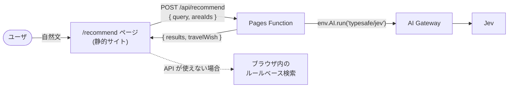

## はじめに

個人開発で、漫画『ざつ旅 -That's Journey-』の聖地巡礼を支援する Web アプリを作っています[^1]。作中に登場するエリアやスポットを地図で探したり、ルーレットで旅先を決めたりできるアプリで、Next.js の静的エクスポートを Cloudflare Pages で配信しています。
今回、このアプリに「温泉でのんびりしたい」「電車だけで行けてレトロな街を歩きたい」のような自然文の希望から、合いそうなエリアを提示するレコメンド機能を追加しました。

順位付けには、TypeSafe AI の Jev を使っています。Jev は文章を生成せず、型付きの判定と確率を返すモデルです。ユーザの希望と各エリアの説明文を渡し、「この希望をどの程度かなえられるか」を採点してもらいます。

Jev の質問設計や精度評価については、以下の記事にまとめています。

https://zenn.dev/temple_c_tech/articles/jev-zero-shot-area-recommend

この記事では、そのレコメンド機能を Cloudflare 上で動かすための実装を紹介します。静的サイトに API を追加する構成と、Workers AI 経由で Jev を呼ぶときにつまずいた点を中心に、応答の扱いや API が使えない場合の実装についてまとめます。

## 構成

アプリ本体は静的エクスポートのままにし、`/api/recommend` だけを Pages Function（`functions/api/recommend.ts`）として追加しました。
この Function から Workers AI のバインディングを使って Jev を呼びます。



処理の流れは次のとおりです。

1. ブラウザから、ユーザの希望文（`query`）と、表示してよいエリアの ID（`areaIds`）を送る
2. Function で各エリアを採点する質問を組み立て、Jev を1回呼ぶ
3. 採点結果をブラウザに返し、スコアの高いエリアを表示する

Function が返すのは、`{ results: [{ areaId, score, confidence }], travelWish }` という判定結果だけです。エリア名や説明文はクライアント側の静的データから表示します。
また、画面では 0〜1 に正規化したスコアを、★1〜5 の「おすすめ度」に変換しています。このスコアは希望への適合度を表す値で、「おすすめである確率」ではないため、% 表示は避けました。

### Function に渡すエリア情報を事前に生成する

Jev に渡すエリアの説明文やタグなどを、エリアプロファイルとして `src/data/area-profiles.json` にまとめています。
元のスポットデータ（`spots.json`）は約1.3 MB あるため、Function にそのまま含めるのは避けたいと考えました。

そこで、ビルド時にプロファイルを生成し、その JSON をリポジトリにコミットする形にしました。Function はこの JSON だけを import します。
生成物をコミットすると元データとのずれが気になりますが、Vitest で「元データから再生成した結果と、コミット済みの JSON が一致すること」を検証し、再生成漏れに気づけるようにしています。

### ネタバレ設定をレコメンドにも反映する

このアプリには「何話まで読んだか」を設定する機能があり、未読のエリアやスポットを隠しています。レコメンドでも、まだ読んでいない話の内容を出さないようにする必要があります。

ブラウザから送る `areaIds` は、この設定で表示できるエリアだけに絞ります。これにより、未読のエリアは採点対象にも結果にも含まれません。

ただ、エリアが既読でも、後の話でそのエリアに新しいスポットが登場することがあります。そのスポットの情報までプロファイルに入れると、レコメンドに未読の内容を使ってしまいます。
そこで、プロファイルに含めるスポットは、**エリアの初登場話までに登場したものだけ**にしました。

エリアを表示できるユーザは、その初登場話までは読んでいます。この範囲の情報に絞れば、ユーザごとにプロファイルを作り分ける必要がなく、事前生成した JSON 1つでネタバレ設定に対応できます。

## Workers AI 経由で Jev を呼ぶ

### TypeSafe の API を直接呼ぶ構成から切り替えた理由

当初は TypeSafe の API を直接呼び、API キーを Pages の secret に保存する予定でした。Workers AI 経由で呼ぶ方法もありましたが、その時点では料金や無料枠の扱いがわからず、採用を見送っていました。

開発を進めるうちに、次のような状況の変化がありました。

- TypeSafe が需要急増で新規登録を一時停止し、waitlist の承認が必要になった
- Cloudflare のダッシュボードに Jev の料金が表示され、TypeSafe の API と同額だと確認できた
- Workers AI のバインディング（`env.AI`）を使えば、TypeSafe の API キーを自分で用意する必要がなかった

API キーの入手に依存せず、設定と請求も Cloudflare にまとめられるため、Workers AI 経由に切り替えました。

### サードパーティモデルには AI Gateway が必要

最初は `env.AI.run("typesafe/jev", ...)` だけで呼べると思っていたのですが、Preview デプロイで 502 になりました。
ドキュメントを確認すると、Jev のようなサードパーティモデルは AI Gateway を経由する必要があり、課金も Unified Billing を使うと書かれていました[^2]。

通常の Workers AI のモデルと同じ感覚で使おうとすると、次の点でつまずきます。

- `env.AI.run` の第3引数に `{ gateway: { id } }` を渡す必要がある
- 料金は Unified Billing の前払いクレジットから引かれる
- Workers AI の無料枠（10,000 Neurons/日）の対象ではない

今回はゲートウェイ ID に `default` を指定しています。この名前を使うと、初回の認証済みリクエストでゲートウェイが自動作成されるため、事前に作成する手順を省けます。

Pages のダッシュボード（Settings → Bindings）で、Workers AI のバインディングを `AI` という名前で追加します[^3]。Production と Preview のそれぞれに設定し、Function から `env.AI` として使います。

呼び出し部分は次のようになりました。

```ts:functions/api/recommend.ts（簡略化）
let timeoutId: ReturnType<typeof setTimeout> | undefined;
try {
  const timeout = new Promise<never>((_, reject) => {
    timeoutId = setTimeout(() => reject(new Error("timeout")), JEV_TIMEOUT_MS);
  });
  result = await Promise.race([
    ai.run(
      "typesafe/jev",
      { state: { request: query }, questions },
      { gateway: { id: "default", collectLog: false } },
    ),
    timeout,
  ]);
} catch {
  // タイムアウト・例外。ユーザの入力文はログに出さない
  return jsonResponse({ error: "upstream_error" }, 502);
} finally {
  clearTimeout(timeoutId);
}
```

`collectLog: false` は、このリクエストの AI Gateway のログ収集を無効にする指定です[^4]。入力文をログに残さないために付けています。

`env.AI.run` で `AbortSignal` を使えることを確認できなかったため、5秒のタイムアウトは `Promise.race` で実装しています。これは Function が応答を待つ時間を制限するもので、Jev 側の処理や課金を止めるものではありません。

### 応答の本体が `result` に入っていた

TypeSafe の API の応答は `{ model, answers, usage }` という形です。一方、今回の AI Gateway 経由の呼び出しでは、次のように本体が `result` に入っていました。

```text
{
  state,
  result: { model, answers, usage },
  gatewayMetadata
}
```

Preview で応答の構造を確認し、`result` に入っている場合と、直接 `answers` が返る場合の両方を扱う関数を用意しました。

```ts:src/lib/recommend.ts
export function extractJevResponse(raw: unknown): JevResponseBody | null {
  if (!isPlainObject(raw)) return null;
  const body = isPlainObject(raw.result) && isPlainObject(raw.result.answers) ? raw.result : raw;
  if (!isPlainObject(body.answers)) return null;
  return {
    model: typeof body.model === "string" ? body.model : undefined,
    answers: body.answers as Record<string, JevAnswerLike>,
    usage: isPlainObject(body.usage) ? (body.usage as JevResponseBody["usage"]) : undefined,
  };
}
```

Jev は生成文をパースする必要がない点が便利ですが、呼び出し経路によって API 応答の形が違うことには注意が必要でした。

### モデルのバージョンを指定できない

Workers AI から呼ぶときのモデル ID は `typesafe/jev` で、`jev-1.13.0` のようなバージョンを指定する形にはなっていません。
今回の質問設計やしきい値は `jev-1.13.0` で調整しているので、モデルが更新されたときに同じ結果が得られるかは確認したいところです。

そこで、TypeSafe が新バージョンを告知したときに、評価スクリプトを再実行する運用にしました。スクリプトでは応答の `model` 名も出力し、どのバージョンで評価したかを確認できるようにしています。

## API が使えないときも検索できるようにする

### ブラウザ内の簡易検索に切り替える

Jev を呼べない場合は、ブラウザ内で動くルールベース検索に切り替えます。別記事で比較に使った、希望文とエリアプロファイルの 2-gram の重なりと、タグの部分一致で採点する方法です。

切り替えるのは、次のような場合です。

- クレジット切れやバインディングの未設定などで、Function がエラーを返した
- 応答を待っても結果が返らず、タイムアウトした
- Function のない環境で静的サイトだけを配信している

クライアント側のタイムアウトは8秒にしています。Function 側の5秒より長くし、Function が返すエラーを受け取る余裕を持たせるためです。

また、簡易検索に切り替わった場合は、画面に「簡易検索の結果です」と表示します。

簡易検索と Jev ではスコアの意味が違うため、簡易検索の結果には★の「おすすめ度」を出さず、順位だけを表示します。
Jev が使えないときも旅先を探せるようにしつつ、同じ方法で採点した結果に見えないようにしました。

### テストで確認する範囲

このアプリの E2E テストは静的ビルドの `out/` を対象にしているため、Pages Function は動きません。
そこで、判定ロジックと画面を分けて確認しています。

| 対象 | 確認方法 |
|---|---|
| リクエストの検証、質問の組み立て、スコアへの変換、レスポンスの整形 | `src/lib` の純粋関数に切り出し、Vitest で検証 |
| 結果やエラー時の画面 | Playwright の `page.route` で `/api/recommend` の応答をモック |
| Workers AI 経由の Jev の呼び出し | バインディングを設定した Preview デプロイで確認 |

画面のテストでは、次のケースを確認しています。

- Function がない環境でも、簡易検索の結果が出る
- AI の結果がスコア順に並び、おすすめ度の★が表示される
- 「旅の希望として読み取れない」「ぴったりの候補がない」場合の表示が出る
- ネタバレ設定で隠したエリアが、リクエストにも結果にも含まれない

TypeSafe の API を直接呼ぶ構成から Workers AI に切り替えたときも、採点などのロジックはそのまま使えました。主な変更は、Function の呼び出し部分と、応答の本体を取り出す部分です。
画面のテストも API の応答をモックしているため、呼び出し経路を変えても同じケースを確認できました。

## おわりに

Cloudflare Pages に Function を追加することで、静的サイトに Jev のレコメンド機能を組み込めました。アプリ全体をサーバーで動かす構成に変えず、API が必要な部分だけを追加できたのは、今回の用途に合っていたと思います。

実装時につまずいたのは、AI Gateway の指定が必要なことと、応答の本体が `result` に入っていたことでした。Jev 自体は型付きの判定を返すため扱いやすいのですが、Workers AI 経由で使う場合は、呼び出し経路の仕様も確認する必要がありました。

採点のロジックと API の呼び出し部分を分けていたことで、TypeSafe の API から Workers AI への切り替えも、主に呼び出し部分の変更で対応できました。API が使えないときは簡易検索に切り替える構成も含めて、今回の用途に合っていたと思います。

今回作成したレコメンド機能は、以下のリンクから試せます。ぜひ、旅の希望を入力してみてください！

https://zatsutabi-planner.com/recommend/

## 参考

[^1]: ざつ旅プランナー: https://zatsutabi-planner.com/
[^2]: [Cloudflare AI Gateway - Workers Bindings](https://developers.cloudflare.com/ai-gateway/usage/worker-binding-methods/)
[^3]: [Cloudflare Pages Functions - Bindings](https://developers.cloudflare.com/pages/functions/bindings/)
[^4]: [Cloudflare AI Gateway - Logging](https://developers.cloudflare.com/ai-gateway/observability/logging/)

- [Cloudflare AI - Jev](https://developers.cloudflare.com/ai/models/typesafe/jev/)
- [Cloudflare AI Gateway - Unified Billing](https://developers.cloudflare.com/ai-gateway/features/unified-billing/)
- [TypeSafe AI Docs - Models](https://docs.typesafe.ai/models)
