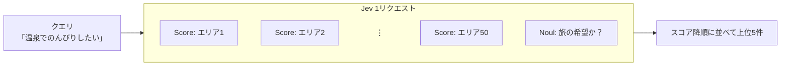

## はじめに

個人開発で、漫画『ざつ旅 -That's Journey-』の聖地巡礼を支援する Web アプリを作っています[^1]。作中に登場するエリアやスポットを地図で探したり、ルーレットで旅先を決めたりできるアプリです。
今回、このアプリに「温泉でのんびりしたい」「電車だけで行けてレトロな街を歩きたい」のような自然文の希望から、合いそうなエリアを提示するレコメンド機能を追加しました。

:::details リリース時のツイート
https://x.com/tmp_friends/status/2103842466789208217
:::

上記のレコメンド機能を実現するにあたって、以下の制約がありました。

- ユーザの行動ログが一切ない
- 学習用の正解データもない
- 全アイテムは50件と少なく、各エリアには説明文とタグしかない

つまり、学習なしで「自然文のクエリ」と「アイテムのテキスト」だけから順位を付ける、Zero-shot なレコメンドになります。

今回は、この順位付けに Jev を使い、ユーザの希望文と各エリアの説明文から適合度を採点する形で実装しました。

## Jev とは

Jev は TypeSafe AI の「System One」と呼ばれる系統のモデルです[^2]。生成文ではなく、型付きの判定と確率を API 経由で返します。

判定の型は3つ用意されています[^3]。どの型も、答えの候補は自分で書いて渡し、Jev はそのどれに当てはまるかを確率で返します。

| 型 | 質問の形 | 返ってくる値 |
|---|---|---|
| Noul | Yes / No で答える | Yes の確率 |
| Choice | 選択肢から1つ選ぶ | 各選択肢の確率と、最も確率の高い選択肢 |
| Score | 段階で答える | 各段階の確率と、段階番号の期待値（0〜3 の4段階なら 0.0〜3.0 の小数） |

低コストで高速に判定できることが特徴で、LLM として一定の精度も期待できます。

## なぜ Jev を選んだか

自然文の希望からエリアを選ぶ方法として、以下を検討しました。

| 方式 | 良い点 | 懸念点 |
|---|---|---|
| ルールベース（タグ・文字列一致） | API 不要でコストゼロ | 「のんびり」「ひなびた」のような雰囲気の表現を拾えない |
| ブラウザ内の埋め込みモデル（Transformers.js 等） | サーバー不要 | 日本語対応モデルのダウンロードが数十〜数百 MB になり、初回体験が重い |
| 生成 LLM で順位付け | 表現力が高い | 1回あたりの料金とレイテンシが大きく、出力のパース・検証も必要 |
| Jev の Score 質問 | 全候補を1リクエストで採点でき、安く、出力が型付き | アーリーアクセスで仕様変更のリスクがあり、日本語精度が保証されない |

言い換えや雰囲気の表現を扱いつつ、コストと実装の手間を抑えたかったため、Jev を選びました。日本語での精度は、後述の評価データセットで確認することにしました。

## Jev でのレコメンド実装

仕組み自体はシンプルで、次の流れです。

1. ユーザの自然文と、各エリアの説明文を Jev に渡す
2. エリアごとに「この希望をどの程度かなえられるか」を4段階で採点してもらう
3. 採点結果でエリアを並べ、上位5件を表示する



学習データがない代わりに、この流れの中で「何を渡すか」「どう採点させるか」「結果をどう扱うか」がそのままレコメンドの品質を決めます。

以降は、Jev に送るリクエストと、Jev から返ってくるレスポンスに分けて説明します。

### リクエスト

実際に送るリクエストは次のとおりです。

```jsonc
{
  "state": { "request": "温泉でのんびりしたい" },
  "questions": {
    "abashiri-shiretoko": {          // エリア ID をキーに、表示中のエリアの数だけ並ぶ（最大50）
      "type": "score",
      "instructions": {
        "area": {
          "name": "網走・知床",
          "prefectures": ["北海道"],
          "description": "能取湖のサンゴ草群落や能取岬をもつ網走から、天に続く道・オシンコシンの滝を経て世界自然遺産・知床のウトロへ至るオホーツク沿岸ドライブルート。…",
          "features": ["網走", "知床", "サンゴ草", "世界遺産", "ドライブ", "温根湯温泉"],
          "accessWithoutCar": "一部に車があると便利な場所がある",
          "rainyDay": "雨でも回りやすいスポットが多い"
        },
        "question": "`area` で、`request` に書かれた旅の希望をどの程度かなえられるか"
      },
      "criteria": [ /* 状況を書いた4段階（後述） */ ]
    },
    // ... 他のエリアも同じ形で続く
    "_is_travel_wish": {             // 入力文が旅の希望として読めるか
      "type": "noul",
      "instructions": "`request` は、旅行先や旅で体験したいことについての希望か",
      "criteria": {
        "true": "行き先・景色・食・過ごし方など、旅の希望が読み取れる",
        "false": "旅と関係のない文、または意味をなさない文字列"
      }
    }
  }
}
```

- `state.request`: ユーザの自然文
  - 全質問で共有する入力です[^4]。ここにはユーザの希望だけを置き、各エリアの情報は個別の質問に渡します。
- `questions.<エリア ID>`: エリアごとの適合度を採点（Score）
  - `instructions.area` にエリア情報、`instructions.question` に「希望をどの程度かなえられるか」という問いを置きます。
  - `criteria` は4段階の採点基準です。各段階を具体的な状況で書きます（後述）。
- `questions._is_travel_wish`: 旅の希望かどうかを判定（Noul）
  - 無関係な入力を除外するため、エリアの採点と同時に判定します。

公式の Reranking 例では、クエリと候補1件を `state` に入れ、候補ごとにリクエストを送ります[^5]。この方式で全候補（50エリア）を採点すると、50回の API 呼び出しが必要になります。

今回は、全質問で共有する `state` にはユーザの希望だけを置き、各エリアの情報はそれぞれの質問の `instructions` に入れました。エリア ID を質問キーにすることで、1つの希望に対する全エリアの採点を1リクエストにまとめ、返ってきたスコアもエリアと対応付けられます。旅の希望かどうかを判定する Noul 質問も同じリクエストに含めるため、この判定のために呼び出しを追加する必要はありません。

#### `criteria`: 段階は「程度」ではなく「状況」で書く

最初の実装では、criteria を次のような5段階にしていました。

```text
0. 希望に全く合わない
1. あまり合わない
2. どちらともいえない
3. 合っている
4. とても合っている
```

アンケートでよく見る形ですが、Jev のドキュメントを読むとこれは良くない書き方でした[^6]。

Score は、各段階を相対的に比べるのではなく、それぞれの基準に当てはまるかを独立に評価します。いわば絶対評価なので、「あまり」「とても」のような程度だけでは判断基準が曖昧になります。そのため、各段階には「どんな状況なら当てはまるか」を具体的に書くことが推奨されています。

そこで、「どんな状況ならその段階か」を書いた4段階に改めました。

```ts:src/lib/recommend.ts
const AREA_CRITERIA_TEXT = [
  "`request` の希望はこのエリアではかなえられない",
  "話題や言葉は `request` と重なるが、希望の中心はかなえられない",
  "`request` の希望の一部をかなえられる",
  "`request` の希望の中心をかなえられ、それがこのエリアの主な魅力になっている",
];
```

個人的に効いていそうだと思っているのが段階1の「話題や言葉は重なるが、希望の中心はかなえられない」です。
キーワードが一致するだけのエリアを明示的に低い段階へ落とせるので、ルールベース検索が苦手な「表層一致」と「意味的な一致」を区別させる狙いがあります。

### レスポンス

レスポンスは次の形で返ってきます（例）。

```jsonc
{
  "answers": {
    "abashiri-shiretoko": {
      "type": "score",
      "score": 1.65,                 // 段階番号の期待値（0〜3）
      "probabilities": { "0": 0.10, "1": 0.30, "2": 0.45, "3": 0.15 },
      // confidence, legend も返る
    },
    // ... 他のエリアも同じ形で続く
    "_is_travel_wish": {
      "type": "noul",
      "noul": 0.97                   // Yes の確率
    }
  },
  "usage": { "input_tokens": ... }
}
```

- `answers.<エリア ID>`: エリアごとの適合度（Score）
  - `score` は段階番号（0〜3）の期待値です。3で割って 0〜1 に正規化し、降順に並べて上位5件を表示します。
  - `probabilities` は各段階の確率です。上の例では、期待値は 0×0.10 + 1×0.30 + 2×0.45 + 3×0.15 = 1.65 になります。
- `answers._is_travel_wish`: 旅の希望かどうかの判定結果（Noul）
  - `noul` は旅の希望である確率です。0.35 未満ならレコメンド結果を表示しません。

しきい値の 0.35 は、TypeSafe の Line-by-line search で「文書に回答がない」と判定する値を参考にしました[^7]。

## 評価

リリース前に、ルールベースより明確に良いことを確認するため、簡単な評価を行いました。
比較対象のルールベースは、クエリとプロファイルの 2-gram の重なりと、タグの部分一致を組み合わせて採点しています。

### 評価データセット

評価データセットは34件で、3種類のクエリを含みます。

| 種類 | 件数 | 例 |
|---|---|---|
| 固有名詞系（proper） | 20 | 「海に浮かぶ大きな朱色の鳥居を見たい」 |
| 雰囲気系（atmosphere） | 9 | 「廃線の面影が残るノスタルジックな路地を歩きたい」 |
| 無関係（irrelevant） | 5 | 「Pythonでソートする方法」「asdfqwerty1234」 |

※ 固有名詞系といっても、「厳島神社」のような名前は出さずに特徴で言い換えたクエリにしています。

### 評価指標

- hit@k: 上位 k 件に期待エリアが含まれる割合（k = 1, 3, 5。irrelevant は除外）
- MRR: 期待エリアの順位の逆数の平均（irrelevant は除外）
- irrelevant のクエリで結果を出さずに済んだ割合（Jev は `travelWish < 0.35`、ルールベースは0件）
- 平均 `input_tokens`: 1リクエストあたりの入力トークン数（= コスト）

### 結果

旅行の希望を表す29件では、Jev はすべてのクエリで期待エリアを上位5件に表示できました。ルールベースで表示できたのは22件でした。ここでいう「期待エリア」は、評価データセットでクエリごとに正解として設定したエリアです。

まず、期待エリアが上位3件に入った件数（hit@3）を、クエリの種類別に見ると次のとおりです。

| 方式 | 全体（29件） | 固有名詞系（20件） | 雰囲気系（9件） |
|---|---|---|---|
| ルールベース | 20/29 (69.0%) | 14/20 (70.0%) | 6/9 (66.7%) |
| Jev | 28/29 (96.6%) | 20/20 (100%) | 8/9 (88.9%) |

次に、期待エリアが何位までに入ったかを比較します。hit@1 は1位、hit@3 は上位3件、hit@5 は上位5件に入った件数です。

| 方式 | 1位（hit@1） | 上位3件（hit@3） | 上位5件（hit@5） | MRR | 期待エリアの最も低い順位 |
|---|---|---|---|---|---|
| ルールベース | 14/29 | 20/29 | 22/29 | 0.616 | 圏外（2問） |
| Jev | 24/29 | 28/29 | 29/29 | 0.894 | 4位 |

MRR は、期待エリアが上位にあるほど高くなる指標です。各クエリについて、1位なら1、2位なら1/2、3位なら1/3として平均し、すべて1位なら1になります。ルールベースは一致する語がないエリアを候補に出さないため、2件では期待エリアが候補に含まれず、その2件は0として計算しています。

無関係な入力5件については、Jev は5件すべてでレコメンド結果を出さずに済みました（`travelWish < 0.35` と判定）。ルールベースで候補が0件になったのは3件でした。

### レイテンシとコスト

今回の環境では、Cloudflare Workers AI 経由で Jev を呼び出したときの応答時間は約300msでした。

1リクエストあたりの入力トークンは平均約2.1万（20,705）で、料金は約 $0.0009 です。1,000リクエストでも1ドルに届かないので、ルールベースとの精度の差を考えると十分見合うと考えています。

### 考察

**Jev はルールベースより明確に良い**

ルールベースは表層の文字列一致で採点しているため、「海に浮かぶ大きな朱色の鳥居」（広島）や「日本本土のいちばん南にある岬」（串本）のように、説明文と言い回しが異なるクエリを取りこぼしていました。
Jev は hit@3 が 96.6%、MRR が 0.894 で、これらのクエリも上位に拾えています。「言い換えや雰囲気の表現を拾いたい」という当初の目的は、Zero-shot でも十分に果たせていると思います。

**Jev が外した質問も、外れとは言い切れない**

Jev が1位を外した質問の中身を見ると、次のように「期待エリア以外も正解と言えそう」なものがほとんどでした。

| クエリ | 期待エリア | Jev の1位 |
|---|---|---|
| 路面電車がのんびり走る温かみのある街を散策したい | 高知・桂浜 | 函館・大沼（こちらも路面電車の街） |
| 都心から少し離れた渓流沿いを歩きたい | 奥多摩 | 寄居・長瀞・宝登山（僅差の2位が奥多摩） |
| 船で渡る小さな島で海水浴とゆったりした宿を楽しみたい | 粟島 | 渡嘉敷島 |
| 海底に沈んだ鳥居のような自然の脅威の跡を見てみたい | 鹿児島市街・桜島 | 広島・宮島（海に立つ大鳥居） |

評価データセットの正解を1エリアに決めているため、hit@1 は実際の使い勝手より低めに出ていると考えています。

**無関係な入力を除外することができている**

「おなかがすいた」という無関係な入力に対しても、エリアの Score は1位が 0.97 になりました。Score だけでは旅行と無関係な入力を除外できないため、旅の希望かどうかを判定する `_is_travel_wish` の Noul 質問が必要でした。こちらは 0.04 となり、レコメンド結果を出さずに済みました。

## おわりに

Jev を用いることで、コストが安く、応答も速く、精度にも満足できる Zero-shot レコメンドを手軽に導入できてよかったです。行動ログや学習用の正解データがない個人開発でも、自然文でエリアを探せる機能を形にできました。
Jev は型付きの判定を返すモデルなので、出力のパースや検証がほぼ不要で、API の返り値をそのままスコアとして扱えるのは実装上かなり楽でした。

Zero-shot レコメンドでは、学習の代わりに「criteria をどう書くか」がスコアリング関数そのものになります。
「程度ではなく状況を書く」「表層一致だけの段階を明示的に用意する」といった書き方は、ラベル設計やアノテーションガイドラインを作るときの考え方に近く、面白いと思いました。


今回作成したレコメンド機能は以下のリンクから試せます。ぜひ、「こんな旅がしたい」という希望の文章を入力してみてください！

https://zatsutabi-planner.com/recommend/

## 参考

[^1]: ざつ旅プランナー: https://zatsutabi-planner.com/
[^2]: TypeSafe AI Docs - Models: https://docs.typesafe.ai/models
[^3]: TypeSafe AI Docs - Primitives: https://docs.typesafe.ai/primitives
[^4]: TypeSafe AI Docs - State: https://docs.typesafe.ai/concepts/state
[^5]: TypeSafe AI Docs - Re-ranking: https://docs.typesafe.ai/cookbooks/rerank_typesafe
[^6]: TypeSafe AI Docs - Score: https://docs.typesafe.ai/primitives/score
[^7]: TypeSafe AI Docs - Line-by-line search: https://docs.typesafe.ai/cookbooks/semantic_find

- TypeSafe AI Docs - Composite scoring: https://docs.typesafe.ai/patterns/composite-scoring
