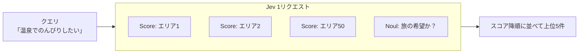

## はじめに

個人開発の Web アプリに、「温泉でのんびりしたい」「電車だけで行けてレトロな街を歩きたい」のような自然文の希望から、合いそうな旅行エリアを50件の中から上位5件で提示するレコメンド機能を追加しました。
スコアリングには、TypeSafe AI が 2026年9月にアーリーアクセスで公開した Jev というモデルを使っています。

この機能には、レコメンドとしては少し変わった制約があります。

- ユーザの行動ログが一切ない（ログインもなく、閲覧履歴も取っていない）
- 学習用の正解データもない
- アイテムは50件と少なく、各エリアには100文字程度の説明文とタグしかない

つまり、学習なしで「自然文のクエリ」と「アイテムのテキスト」だけから順位を付ける、Zero-shot なレコメンドになります。
この記事では、以下の点についてまとめようと思います。

- Jev とはどういうモデルか
- Jev の Score 質問を使った Zero-shot レコメンドの設計
- 質問（criteria）の書き方で気をつけたこと
- 質問設計の違いによる精度の比較

:::message
Web アプリへの組み込み（Cloudflare Workers AI 経由の呼び出し、コストの上限管理、フォールバックなど）については別記事にまとめています。
TODO: 別記事のリンクを貼る
:::

## Jev とは

Jev は TypeSafe AI の「System One」と呼ばれる系統のモデルで、テキストを生成せず、型付きの判定とその確率だけを返すホスト型モデルです[^1]。

判定の型（プリミティブ）は3つ用意されています[^2]。

| プリミティブ | 答える問い | 返り値 |
|---|---|---|
| Noul | 「これは真か？」 | Yes の確率 |
| Choice | 「どの選択肢か？」 | choice, probabilities, confidence |
| Score | 「どの段階か？」 | score, legend, probabilities, confidence |

リクエストは「評価対象の `state`」と「`state` に対する質問の集合 `questions`」から成ります。1リクエスト内の質問はすべて同じ `state` を見て、互いに独立に、並列に評価されます。
返り値は必ず自分で与えた選択肢・段階の上の確率分布になるので、生成モデルのように出力文をパースしたり、想定外の値を弾いたりする必要がありません。

その他の特徴は次のとおりです[^1]。

- 料金は入力トークンのみの課金で $0.042 / 100万トークン（出力は無料）
- 顧客ごとのファインチューニングはせず、全アカウントで同じ重みを使う（カスタマイズは `state` と質問で行う）
- 主要な学習言語は英語で、日本語などは精度が劣ると明記されている

「ファインチューニングせず、判定基準を自然文で書いて与える」という点が、そのまま Zero-shot レコメンドに向いていると思いました。

## なぜ Jev を選んだか

自然文の希望からエリアを選ぶ方法として、以下を検討しました。

| 方式 | 良い点 | 懸念点 |
|---|---|---|
| ルールベース（タグ・文字列一致） | API 不要でコストゼロ | 「のんびり」「ひなびた」のような雰囲気の表現を拾えない |
| ブラウザ内の埋め込みモデル（Transformers.js 等） | サーバー不要 | 日本語対応モデルのダウンロードが数十〜数百 MB になり、モバイルの初回体験が重い |
| 生成 LLM で順位付け | 表現力が高い | 1回あたりの料金とレイテンシが大きく、出力のパース・検証も必要 |
| Jev の Score 質問（採用） | 全候補を1リクエストで採点でき、安く、出力が型付き | アーリーアクセスで仕様変更のリスクがあり、日本語精度が保証されない |

レコメンドの文脈でいうと、埋め込みモデルはクエリとアイテムを別々にベクトル化する Bi-Encoder 的なアプローチで、Jev の Score はクエリとアイテムのペアごとに採点する Cross-Encoder（リランカー）的なアプローチに近いと考えられます。
Cross-Encoder は全ペアを評価する必要があるので通常は候補を絞り込んでから使いますが、今回はアイテムが50件しかないので、候補生成を挟まずに全件をそのまま採点できます。


*1回の検索で全エリアを採点する*

## Zero-shot レコメンドの設計

仕組み自体はシンプルで、次の流れです。

1. ユーザの自然文と、各エリアの説明（エリアプロファイル）を Jev に渡す
2. エリアごとに「この希望をどの程度かなえられるか」を4段階で採点してもらう
3. 採点結果でエリアを並べ、上位5件を表示する

学習データがない代わりに、この流れの中で「何を渡すか」「どう採点させるか」「結果をどう扱うか」がそのままレコメンドの品質を決めます。
以降は、Jev に送るリクエストと、Jev から返ってくるレスポンスに分けて説明します。

- リクエスト: ユーザの自然文とエリアの情報を、どこに、どう書いて渡すか
- レスポンス: どんな答えを返させ、それをどう使うか

### リクエスト: 何を、どこに渡すか

1回の検索で実際に送るリクエストは次のとおりです。

```jsonc
{
  "state": { "request": "温泉でのんびりしたい" },
  "questions": {
    "abashiri-shiretoko": {          // エリア ID をキーに、表示中のエリアの数だけ並ぶ（最大50）
      "type": "score",
      "instructions": {
        "area": {
          "name": "網走・知床",
          "prefectures": ["北海道"],
          "description": "能取湖のサンゴ草群落や能取岬をもつ網走から、天に続く道・オシンコシンの滝を経て世界自然遺産・知床のウトロへ至るオホーツク沿岸ドライブルート。…",
          "features": ["網走", "知床", "サンゴ草", "世界遺産", "ドライブ", "温根湯温泉"],
          "accessWithoutCar": "一部に車があると便利な場所がある",
          "rainyDay": "雨でも回りやすいスポットが多い"
        },
        "question": "How well can the travel wish in `request` be fulfilled in `area`?"
      },
      "criteria": [ /* 状況を書いた4段階（後述） */ ]
    },
    // ... 他のエリアも同じ形で続く
    "_is_travel_wish": {             // 入力文が旅の希望として読めるか
      "type": "noul",
      "instructions": "Is `request` a wish about a travel destination or something to experience on a trip?",
      "criteria": {
        "true": "A travel wish can be read from it: a destination, scenery, food, activities, or how to spend time.",
        "false": "It is unrelated to travel, or it is not meaningful text."
      }
    }
  }
}
```

- `state.request`: ユーザの自然文
- `questions.<エリア ID>`: エリアごとの採点の質問（Score）。`instructions.area` にエリアの情報、`criteria` に4段階の判定基準を書く
- `questions._is_travel_wish`: 入力文が旅の希望として読めるかの判定（Noul）

以下、`state`、`questions`、`instructions` の順に、それぞれで意識したことを説明します。

#### `state`: ユーザの自然文だけを置く

全エリアのプロファイルを `state` に入れ、各質問から参照する形も考えられます。ただ、それだと各質問に「残り49エリア分の無関係な情報」を見せることになります。
質問に関係のない情報を `state` に入れると精度が落ちる（いわゆる context rot）ため、`state` にはユーザの自然文だけを置き、各質問の `instructions.area` にはそのエリアの情報だけを持たせています。

#### `questions`: 全エリアを1リクエストに並べる

エリアごとに別リクエストにする（リランキングの一般的な型）と、1検索で最大50回の外部呼び出しになってしまいます。
質問キーをエリア ID にして1リクエストに並べることで、1検索 = Jev 1コールに収めています。各質問は独立に評価されるので、並べても他のエリアの情報が混ざることはありません。

:::details 他に検討した構成
- 2段階（Choice で候補を探す → 上位だけ Score で再評価）
  - 候補が50件しかなく全件を再評価しても費用は変わらないので、1段目で落ちた候補を拾えない欠点だけが残ると判断しました
- 観点別スコアの合成（Composite scoring）
  - 温泉・海・レトロなどの観点ごとにエリアを事前採点し、入力文から観点の重みを判定して合成する方式です
  - 「おすすめ理由」を観点タグとして出せる利点がありますが、観点一覧の設計とビルド時の採点バッチが必要になるので、将来の拡張として保留しました
:::

#### `instructions`: エリアの情報を項目名の付いた言葉で渡す

最初の実装では、評価の依頼文とエリアの情報を1本の日本語テキストに連結して `instructions` に入れていました。

```jsonc:変更前（テキスト連結）
"instructions": "次の旅行エリアの特徴が、ユーザーの希望(state)にどれくらい合うか評価してください。エリアの特徴: 網走・知床(北海道)。能取湖のサンゴ草群落や…ドライブルート。特徴タグ: 網走・知床・サンゴ草・世界遺産・ドライブ・温根湯温泉。車での移動: 一部に車があると便利な場所がある。雨でも回りやすいスポットが多い。"
```

これだと、どこまでが依頼文でどこからがエリアの情報か、「一部に車があると便利」が何についての説明かを、モデルが文面から読み取る必要があります。
そこで TypeSafe のドキュメントの推奨に合わせて、上のリクエスト例のように質問文（`question`）とエリアの情報（`area`）を分け、エリアの情報は項目名の付いたオブジェクトのまま渡すようにしました。各値に `accessWithoutCar` のような項目名が付き、質問文からも `area` や `request` と名前で参照できます。

あわせて、値そのものも言葉にしています。元データでは「車なし難易度」を ◎/○/△/× の記号で持っていますが、記号はモデルの手がかりになりにくいので、「電車・バスだけで回りやすい」のような言葉に置き換えています。

```ts:src/lib/area-profile.ts
function accessWithoutCarLabel(difficulty: ProfileArea["travel"]["carFreeDifficulty"]): string {
  switch (difficulty) {
    case "◎":
      return "電車・バスだけでとても回りやすい";
    case "○":
      return "電車・バスだけで回りやすい";
    case "△":
      return "一部に車があると便利な場所がある";
    case "×":
      return "車がないと回るのが難しい";
  }
}
```

### レスポンス: 何を答えさせ、どう使うか

レスポンスは次の形で返ってきます（数値は説明用の例です）。

```jsonc
{
  "answers": {
    "abashiri-shiretoko": {
      "type": "score",
      "score": 1.65,                 // 段階番号を確率で重み付けした平均（0〜3）
      "probabilities": { "0": 0.10, "1": 0.30, "2": 0.45, "3": 0.15 },
      // confidence, legend も返る
    },
    // ... 他のエリアも同じ形で続く
    "_is_travel_wish": {
      "type": "noul",
      "noul": 0.97                   // Yes の確率
    }
  },
  "usage": { "input_tokens": ... }
}
```

- `answers.<エリア ID>.score`: エリアごとの採点結果。`criteria` に書いた段階の番号（0〜3）を、各段階の確率で重み付けした平均
- `answers.<エリア ID>.probabilities`: 各段階の確率
- `answers._is_travel_wish.noul`: 入力文が旅の希望として読める確率

返ってくる値の意味は、リクエスト側の `question` と `criteria` で決まります。以下、`question`、`criteria` の書き方と、返ってきた `score` と `noul` の使い方を説明します。

#### `question`: 1つの質問では1つの観点だけを測る

測るのは「このエリアで入力文の旅の希望をどの程度かなえられるか」だけにしています。
「雰囲気が合うか」「勧めたいか」のような別の観点を同じ Score に混ぜると、どの段階に当てはまるかが曖昧になり、返ってくる確率の意味もぼやけてしまうためです。

#### `criteria`: 段階は「程度」ではなく「状況」で書く

最初の実装では、criteria を次のような5段階にしていました。

```text
0. 希望に全く合わない
1. あまり合わない
2. どちらともいえない
3. 合っている
4. とても合っている
```

アンケートでよく見る形ですが、Jev のドキュメントを読むとこれは良くない書き方でした[^3]。

- Score の各段階は独立に評価され、モデルは段階の番号や隣の段階を見ない
- そのため「あまり」「どちらともいえない」のような相対的な程度の言葉は手がかりにならない
- 「程度ではなく状況を書く」ことが推奨されている

そこで、「どんな状況ならその段階か」を書いた4段階に改めました。

```ts:src/lib/recommend.ts
const AREA_CRITERIA_TEXT: Record<JevQuestionLanguage, JevScoreCriteriaText> = {
  en: [
    "The travel wish in `request` cannot be fulfilled in this area.",
    "The area shares topics or words with `request`, but the core of the wish cannot be fulfilled here.",
    "Part of the travel wish in `request` can be fulfilled in this area.",
    "The core of the travel wish in `request` can be fulfilled here, and it is one of this area's main attractions.",
  ],
  ja: [
    "`request` の希望はこのエリアではかなえられない",
    "話題や言葉は `request` と重なるが、希望の中心はかなえられない",
    "`request` の希望の一部をかなえられる",
    "`request` の希望の中心をかなえられ、それがこのエリアの主な魅力になっている",
  ],
};
```

個人的に効いていそうだと思っているのが段階1の「話題や言葉は重なるが、希望の中心はかなえられない」です。
キーワードが一致するだけのエリア（例: 地名に「温泉」が入っているが、実際に入れる湯はない）を明示的に低い段階へ落とせるので、ルールベース検索が苦手な「表層一致」と「意味的な一致」を区別させる狙いがあります。

#### `question` / `criteria`: 言語と記述形式を切り替えられるようにする

精度評価で比較するため、以下を設定で切り替えられるようにしています。

- 質問文と criteria の言語（英語 / 日本語）
  - Jev は英語の精度が最も高いので、本番の既定は英語にしています。入力文とエリアのデータは日本語のままです
  - 50問ぶん繰り返す criteria のトークンを減らせる、という狙いもあります
- criteria の形式（文字列 / `{ what, examples }` のオブジェクト）
  - ドキュメントで紹介されている Structured level descriptions の形で、段階ごとに具体例を添えられます

:::details structured 形式の criteria
```ts:src/lib/recommend.ts
const AREA_CRITERIA_STRUCTURED_EN: JevScoreCriteriaStructured = [
  {
    what: AREA_CRITERIA_TEXT.en[0],
    examples: [
      "wish: skiing / area: a coastal fishing town with no mountains or snow",
      "wish: art museums / area: a rural hot-spring village with no galleries",
    ],
  },
  {
    what: AREA_CRITERIA_TEXT.en[1],
    examples: [
      "wish: onsen stay / area: only mentions a hot-spring town name in passing, no baths to visit",
      "wish: temple pilgrimage / area: has one shrine mentioned briefly, not a pilgrimage route",
    ],
  },
  {
    what: AREA_CRITERIA_TEXT.en[2],
    examples: [
      "wish: seafood and hot springs / area: known for hot springs, but seafood is only a minor side note",
      "wish: retro shopping streets and trains / area: has an old shopping street but no notable train experience",
    ],
  },
  {
    what: AREA_CRITERIA_TEXT.en[3],
    examples: [
      "wish: onsen stay / area: a hot-spring town whose main draw is its bathhouses and ryokan",
      "wish: scenic train ride through a gorge / area: famous for exactly that kind of train ride",
    ],
  },
];
```
:::

#### `score` / `noul`: 答えから「該当なし」を判定する

Score だけだと、どんな入力でも必ず上位5件が出てしまいます。「Pythonでソートする方法」と入力しても何かしらのエリアがおすすめされるのは不自然なので、返ってきた答えから次の2つを判定しています。

| 判定 | 使う値 | しきい値 | 表示 |
|---|---|---|---|
| 旅の希望として読めない | `_is_travel_wish` の `noul` | 0.35 未満 | 結果を出さず「旅の希望として読み取れませんでした」 |
| ぴったりの候補がない | 1位のエリアの `score`（0〜1 に正規化） | 2/3 未満 | 「ぴったりのエリアは見つかりませんでした。近い候補を表示しています」と添えて上位5件 |

`score` は0〜3で返ってくるので、3で割って 0〜1 にしてから使っています。2/3 はちょうど段階2「希望の一部をかなえられる」にあたります。しきい値を段階の意味に対応させておくと、「なぜこの値なのか」を説明しやすいのが良いところです。0.35 のほうは、TypeSafe の Line-by-line search の例に倣いました。

`_is_travel_wish` はリクエストに1問足すだけなので、呼び出し回数は増えません。1リクエストに複数の判定を並べられる Jev の性質が活きているところだと思います。

## 精度評価

### 評価方法

公開前に、ルールベースより明確に良いことを確認するため、評価スクリプト（`scripts/recommend/eval.mjs`）と評価セットを用意しました。

評価セットは34件で、3種類のクエリを含みます。

| 種類 | 件数 | 例 |
|---|---|---|
| 固有名詞系（proper） | 20 | 「海に浮かぶ大きな朱色の鳥居を見たい」 |
| 雰囲気系（atmosphere） | 9 | 「廃線の面影が残るノスタルジックな路地を歩きたい」 |
| 無関係（irrelevant） | 5 | 「Pythonでソートする方法」「asdfqwerty1234」 |

固有名詞系といっても、「厳島神社」のような名前は出さずに特徴で言い換えたクエリにしています。
指標は以下です。

- hit@3: 上位3件に期待エリアが含まれる割合（irrelevant は除外）
- 平均 `input_tokens`: 1検索あたりの入力トークン数（= コスト）
- irrelevant のクエリで `travelWish < 0.35` と正しく判定できた割合
- 固有名詞系・雰囲気系のクエリで `travelWish < 0.35` と誤判定した件数

比較する方式（variant）は次の4つです。

| variant | 内容 |
|---|---|
| `legacy` | 初期実装（5段階・程度表現の criteria・プロファイルをテキスト連結） |
| `ja` | 改善後の構成、質問文と criteria が日本語 |
| `en` | 改善後の構成、質問文と criteria が英語（本番の既定） |
| `en-structured` | `en` の criteria を `{ what, examples }` にしたもの |

ベースラインのルールベースは、アプリのフォールバック（API が使えないときの簡易検索）と同じ実装で、クエリとプロファイルの2-gram の重なりと、タグの部分一致を組み合わせて採点しています。

Jev の生の応答（段階別確率・confidence・usage）はローカルに保存しておき、スコアの計算方法やしきい値を見直すときに追加費用なしで再集計できるようにしています。

### 結果

:::message alert
TODO: Jev（legacy / ja / en / en-structured）の実測値を埋める。
:::

| 方式 | hit@3（全体） | 固有名詞系 | 雰囲気系 | 平均 input_tokens | irrelevant の正答 |
|---|---|---|---|---|---|
| ルールベース | 20/29 (69.0%) | 14/20 (70.0%) | 6/9 (66.7%) | — | 3/5（0件で返せた問） |
| legacy | TODO | TODO | TODO | TODO | 判定なし |
| ja | TODO | TODO | TODO | TODO | TODO |
| en | TODO | TODO | TODO | TODO | TODO |
| en-structured | TODO | TODO | TODO | TODO | TODO |

### 考察

ルールベースは表層の文字列一致で採点しているため、「海に浮かぶ大きな朱色の鳥居」（広島）や「日本本土のいちばん南にある岬」（串本）のように、説明文と言い回しが異なるクエリを取りこぼしていました。
irrelevant でも「おなかがすいた」「Pythonでソートする方法」で何かしらのエリアを返しており、表層一致だけで「該当なし」を判断するのは難しいことがわかります。

TODO: Jev の結果に対する考察を書く。

:::message
英語の criteria 版はリクエスト JSON が約3.8万文字、`en-structured` は例文が50問ぶん繰り返されるため約7.9万文字と倍近くになります。Workers AI 経由の `typesafe/jev` はコンテキスト長が 32,000 トークンと表示されているので、structured 形式を本番で使う場合はトークン数に注意が必要そうです。
:::

:::message
アプリからは Cloudflare Workers AI 経由で Jev を呼んでおり、モデルのバージョンを固定できません（`jev-latest` 相当に追随します）。上記の criteria やしきい値は `jev-1.13.0` で調整したものなので、新バージョンが告知されたら評価スクリプトを再実行する運用にしています。
:::

## おわりに

生成モデルではなく型付きの判定を返すモデルなので、出力のパースや検証がほぼ不要で、API の返り値をそのままスコアとして扱えるのは実装上かなり楽でした。

Zero-shot レコメンドでは、学習の代わりに「criteria をどう書くか」がスコアリング関数そのものになります。
「程度ではなく状況を書く」「表層一致だけの段階を明示的に用意する」といった書き方は、ラベル設計やアノテーションガイドラインを作るときの考え方に近く、面白いと思いました。

今後は以下を試してみたいと思っています。

- 評価結果を見て、日本語 criteria / structured 形式の採否としきい値を見直す
- 観点別のスコア合成（Composite scoring）。Jev ではテキストを生成できないために出せていない「おすすめ理由」を、観点タグとして出せるようになるのではないかと思います
- ログが溜まってきたら、Zero-shot のスコアを特徴量の1つとして、行動ログを使ったランキングと組み合わせる

## 参考

[^1]: TypeSafe AI Docs - Models: https://docs.typesafe.ai/models
[^2]: TypeSafe AI Docs - Primitives: https://docs.typesafe.ai/primitives
[^3]: TypeSafe AI Docs - Score: https://docs.typesafe.ai/primitives/score

- TypeSafe AI Docs - State: https://docs.typesafe.ai/concepts/state
- TypeSafe AI Docs - Re-ranking: https://docs.typesafe.ai/cookbooks/rerank_typesafe
- TypeSafe AI Docs - Line-by-line search: https://docs.typesafe.ai/cookbooks/semantic_find
- TypeSafe AI Docs - Composite scoring: https://docs.typesafe.ai/patterns/composite-scoring
