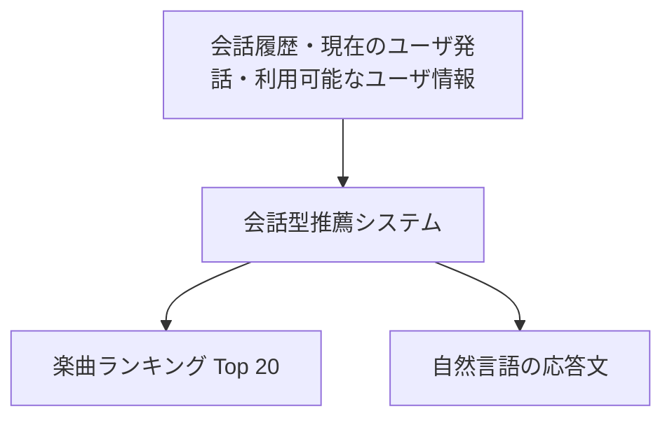

## はじめに

DMM.com のデータサイエンス&AIグループで、レコメンドシステムの開発を担当している寺井です。

RecSys Challenge 2026[^1] に参加し、総合16位、Industry Track では8位という結果になりました。また、コンペ中に行ったデータセットと評価指標の分析を論文にまとめ、2026/10/2 に開催された RecSys Challenge Workshop で発表してきました[^2]。

今回のテーマは、ユーザと音楽について会話しながら、その時点の要求に合った楽曲を推薦する Conversational Music Recommendation（会話型楽曲推薦）です。楽曲のランキングに加えて、推薦理由を伝える自然言語の応答も生成します。

本記事では、コンペの概要と実際のデータ例、上位解法を紹介したうえで、自身の取り組みと、論文で分析した評価の整合性について紹介します。

## コンペ概要

### 会話から楽曲ランキングと応答文を生成する

RecSys Challenge は、レコメンドシステムの国際会議 ACM RecSys に併設されるコンペです。2026年は、会話履歴と現在のユーザ発話、利用可能なユーザ情報を入力として、次の2つを出力するタスクでした。以下の競技条件、データ、指標、順位は、主催者の総括論文に基づいています[^3]。

- 47,071曲のカタログから選ぶ Top 20 の楽曲ランキング
- 会話の文脈やユーザの嗜好を踏まえた自然言語の応答文



ユーザの発話には、曲名を直接指定するものもあれば、「もう少し落ち着いた曲で」のように、直前の推薦を受けて条件を変えるものもあります。固有名詞を正確に照合するだけでなく、会話を通じて変化する意図を捉える必要があります。

評価では、与えられた会話履歴に対して、そのターンのランキングと応答文を生成します。生成した応答にユーザが返答し、その後の会話が変化していくような評価ではなく、各ターンの入力はあらかじめ決まっています。

### 評価指標

最終順位は、以下の4つの指標を重み付きで合計した Composite Score によって決まります。

| 指標 | 重み | 評価内容 |
| --- | ---: | --- |
| nDCG@20 | 50% | 正解曲をランキングの上位に出せているか |
| Catalog Diversity | 10% | 提出全体で、どれだけ多くの異なる曲を推薦しているか |
| Lexical Diversity | 10% | 応答文の表現がどれだけ多様か |
| LLM-as-a-Judge | 30% | 応答文の Personalization と Explanation Quality |

各ターンには1曲の正解曲があり、その曲を上位に出すほど nDCG@20 が高くなります。Catalog Diversity は、カタログ全体に対して、提出したランキングに含まれる異なる曲が占める割合です。

Lexical Diversity には、応答全体に含まれる単語の 2-gram の多様性を測る Distinct-2 が使われます。LLM-as-a-Judge の評点は1〜5で、`(評点 − 1) / 4` によって0〜1へ正規化してから加算されます。

この評価では、曲を選ぶ能力と、選んだ曲について応答する能力が一つのスコアにまとめられています。この点が、後述する分析にも関係してきます。

## データセット

### TalkPlayData-Challenge の生成方法

使用されたのは、TalkPlayData-Challenge という合成会話データセットです。学習用には15,199セッション、開発用には1,000セッションがあり、それぞれ8回の推薦ターンを含みます。

基になった TalkPlayData 2[^4] では、実際の音楽聴取履歴や楽曲情報を土台として、役割の異なる LLM が会話を生成します。中心となるのは、ユーザ役の Listener LLM と、レコメンドシステム役の Recsys LLM です。

各会話には、ユーザが達成したい Conversation Goal が設定されます。Listener LLM はその目標を知ったうえで発話しますが、Recsys LLM には目標が直接渡されません。Recsys LLM は、会話を通じて要求を理解し、楽曲を選びます。

公開データには、会話履歴に加えて、ユーザプロフィール、会話の目標、目標への進み具合を表すラベルも含まれています[^5]。また、別のデータとして楽曲メタデータや、楽曲・ユーザの Embedding も提供されています。

ただし、公開データに含まれる情報を、最終評価でもすべて使えるわけではありません。Blind B では目標への進捗や生成時の推論に関する情報が取り除かれ、80セッション中40セッションではユーザ ID とプロフィールも隠されています。プロフィールが使えることを前提とせず、会話と楽曲の情報から候補を集められる構成も必要になります。

### 実際のレコード

データの形式が分かるように、公開学習データから、最初のユーザ発話と楽曲 ID に関するフィールドを抜粋します。応答文や後続ターンなどは省略しています。

```json
{
  "session_id": "b9bbaba3-c014-4435-95be-e6b92b239e37",
  "conversations": [
    {
      "role": "user",
      "turn_number": 1,
      "content": "Play 'Madness' by Muse."
    },
    {
      "role": "music",
      "turn_number": 1,
      "content": "b87391bb-0e53-4333-83eb-19d5b9662599"
    }
  ]
}
```

ユーザの発話は、「Muse の『Madness』を流して」という、曲名とアーティストを指定した要求です。`role: "music"` の `content` には楽曲 ID が入っており、楽曲メタデータと結び付けることで、推薦された曲の情報を確認できます。

一方で、次のような発話から始まるセッションもあります。

> I want to discover some new artists. Do you have anything that's a bit intense or dramatic?

「新しいアーティストを知りたい。少し激しい、あるいはドラマチックな感じの曲はありますか？」という要求です。この会話の目標も、特定のジャンルに限定せず、雰囲気やスタイルを手掛かりにアーティストや楽曲を探索する内容になっています。

前者は特定の曲を探す要求ですが、後者には複数の妥当な推薦がありそうです。それでも、コンペの nDCG 評価では、各ターンに1曲の正解曲が設定されます。会話の意図に合う曲を選ぶことと、データセットに記録された曲を当てることには、違いがあると感じました。

### Goal Progress と推薦ターンの対応

データを読む際に注意したいのが、`goal_progress_assessments` の意味です。

2ターン目以降では、Listener LLM が直前の推薦を評価し、その後に次の要求を生成します。Recsys LLM は、その要求を受けて次の曲を選びます。

```text
ターン t−1 の推薦曲
        │
        ▼
Listener LLM
  ├── 直前の推薦が目標に近づいたかを評価
  └── ターン t のユーザ発話を生成
        │
        ▼
Recsys LLM
  ├── ターン t の楽曲を選択
  └── 応答文を生成
```

したがって、ターン `t` の Goal Progress は、そのターンでこれから選ばれる曲ではなく、ターン `t−1` の推薦に対する評価です。また、人間が付けた満足度ラベルではなく、合成データの生成過程で Listener LLM が付けたラベルです。

後述する分析では、この時間的な対応と、ラベルを付けた主体を踏まえて解釈しています。

## 上位解法：Retriever・Reranker・Response Generatorで比較する

上位チームの構成を、候補曲を集める **Retriever**、候補を並べ替える **Reranker**、自然言語の返答を作る **Response Generator** に分けて整理します。以下は、主催者の総括論文と各チームの論文に基づく比較です。順位は Blind B の総合順位です。

| チーム・総合順位 | Retriever：候補生成 | Reranker：順位付け | Response Generator：応答生成 | その他の工夫 |
| --- | --- | --- | --- | --- |
| **hallucinated・1位※** | BM25、意味検索、Two-Tower、ItemKNN、マルチモーダルな系列モデルなどを組み合わせます。 | 重み付き RRF で候補を統合し、**XGBoost のランキングモデルをアンサンブル**します。 | **Gemma-4-26B-A4B-it** で、会話の要約、応答生成、圧縮、表現の多様化を段階的に行います。 | 候補生成の調整に CVaR を利用し、平均的な性能だけでなく、性能が低いケースも重視します。評価データの利用については下記の注記があります。 |
| **volart・2位** | BM25、**text-embedding-3-large**、LLM で生成した楽曲説明を使う検索、楽曲の共起という4経路を RRF で統合します。 | **LambdaMART** を使用します。プロフィールなどの入力情報が欠ける場合も扱える特徴量を設計しています。 | **Gemini-3.1-Flash-Lite** で複数の応答候補を生成・選択し、別モデルの **gpt-4o-mini** を critic として文章を修正します。 | **ローカル GPU を使わず、CPU と外部 API で構築**しています。ランキングを固定したまま、応答側を独立して改善します。[^6] |
| **niwatori・3位** | BM25、TF-IDF、**Qwen3-Embedding-0.6B を LoRA で調整した Two-Tower**、アーティスト・アルバム展開、履歴・共起・遷移など、**14ソース**を利用します。 | **LightGBM LambdaRank** を使用します。各検索器での出現有無・順位・スコアと、会話と楽曲の関係を表す特徴量を入力します。 | **Qwen3.6-27B** に上位3曲のメタデータと会話を渡します。各ケースで10個の応答候補を生成し、提出全体の表現の多様性を考慮して選択します。 | 学習対象のデータを除いて作る **OOF 特徴量**を利用します。また、誤りを「検索漏れ」「Top 20 からの除外」「Top 20 内の順位損失」に分解しています。[^7] |
| **swyoo・4位** | **BM25＋固定した Qwen3-Embedding-0.6B** の検索と、**QLoRA で調整した Qwen3-Embedding-8B** による会話検索を併用します。 | 両系統の上位100候補を統合し、**LightGBM** で並べ替えます。検索順位・スコアに加え、会話位置や要求の種類も利用します。 | **GLM-5.2** と **Propose–Assign–Select（PAS）** を使用します。候補と説明の根拠を対応付けて生成し、曲名の表記や根拠への参照をルールで検証・修正します。 | 外部メタデータでカタログを補完します。応答生成では、要求の種類や会話位置に合うお手本を選んで提示します。[^8] |
| **PoliBaJukebox・5位** | 文字列検索、協調フィルタリング、**CLAP の音響情報**、Qwen の埋め込み、調整済みの BGE-base／BGE-large など、**10ソース**を利用します。 | 重み付き RRF に加え、**LightGBM LambdaRank と CatBoost YetiRank** を使用します。 | **Gemini-3.1-Pro-Preview** で下書きを生成し、**Gemini-3.5-Flash** で冗長な表現などを修正します。推薦曲や説明の根拠は維持します。 | **Adversarial Validation で開発データと Blind データの分布差を推定**し、ランキングモデルの学習時にサンプルの重みを調整します。[^9] |

RRF は、複数の検索結果を順位に基づいて統合する方法です。OOF は Out-of-Fold の略で、ある学習行の特徴量を、その行を含まないデータで学習したモデルから作る方法です。niwatori では、正解情報を利用する Retriever から Reranker へ情報が漏れ込むことを避けるために使っています。

※総合1位の hallucinated について、主催者の総括論文は、**Blind B の会話ターンを重み調整や Reranker の学習に利用した点**を注記しています。非公開の正解曲を利用したという意味ではありませんが、未見の会話への汎化という評価条件が異なるため、性能の単純比較には注意が必要です。

### Retriever では、異なる手掛かりを拾える組み合わせが重要です

上位解法では、意味検索だけですべてを解こうとするのではなく、文字列検索、アーティストやアルバムの関係、聴取履歴の共起などを組み合わせています。例えば niwatori では、固有名詞を拾う検索と、会話の意味や楽曲間の関係を使う検索を併用しています。**検索器の数そのものより、異なる理由で候補を拾えること**が重要な設計上のポイントだと捉えています。

### Reranker では、候補の「出どころ」を残しています

niwatori や swyoo では、候補曲を集めた後も、どの検索経路で何位だったか、どのくらいのスコアだったかを保持しています。これにより、Reranker は検索器間の一致や、要求に応じた検索経路の違いを利用できます。**候補を一つのリストにまとめるだけでなく、候補を支持する情報も渡す**構成です。

### Response Generator では、モデル選択以外の工夫も見られます

応答生成では、大きな LLM を使うだけでなく、複数候補からの選択、別モデルによる批評・修正、根拠の割り当て、生成後の検証といった処理が組み込まれています。特に swyoo の PAS は、「根拠に基づいて説明してください」という指示だけでなく、**どの情報を説明の根拠として使えるかを、生成処理の中で明示する**構成です。

このように、曲を選ぶ処理と、選んだ曲を説明する処理は、別々に改善できます。そのため、総合スコアを見る際にも、ランキングが改善したのか、応答文が改善したのかを分けて考える必要があります。この点は、次に紹介する自分の論文の問題意識にもつながっています。

## 自身の取り組みと分析のきっかけ

コンペ中は、会話の意味をよりうまく捉えられれば、推薦精度も改善するだろうと考えていました。そこで、Qwen-Embedding を会話文で Fine-tuning し、意味的に合う楽曲を候補生成へ加えることなどを試していました。

ところが、期待したほどスコアが伸びませんでした。一方で、会話に出てきたアーティストを抽出し、そのアーティストの別の曲を候補に入れる方が効く場面がありました。

このとき気になったのが、ユーザの要求を理解することよりも、「会話に登場したアーティストの曲かどうか」が強く効いているように見えた点です。例えば、ユーザが別のアーティストを求めている場面でも、会話に登場したアーティストの曲を推薦する方が、評価上は有利になっているかもしれません。

今回試した意味検索の構成には改善の余地があるとしても、モデルの改善だけでは説明しきれない問題が、データや評価の側にもあるのではないかと感じました。そこで、正解として記録されている曲と、会話の目標やユーザの要求との関係を調べることにしました。

## 論文で分析したこと

論文のタイトルは、Auditing Alignment among Item Relevance, Goal Progress, and LLM-Judged Responses in Music-CRS です。

以下の3つの軸が整合しているかを分析しました。

| 軸 | 確認したいこと |
| --- | --- |
| Item Relevance | データセットの正解曲を推薦できているか |
| Goal Progress | 合成データ上で、直前の推薦が会話の目標に近づいたと評価されているか |
| Response Quality | LLM-as-a-Judge から見て、よい応答文になっているか |

新しいランキング手法の提案ではなく、ベンチマークの評価が何を捉えているのか、評価軸の間にどのような食い違いがあるのかを点検する研究としてまとめました。

### RQ1: Item Relevance と Goal Progress の整合性

#### アーティスト変更要求と正解曲の不一致

まず、発表資料でも取り上げた実例を紹介します。公開学習データの監査用エクスポートに記録されている会話で、自分のシステムが生成したものではありません。

セッション `0b477fcb-00ce-405f-9ce7-e521f0a10f38` の2〜3ターン目では、次のようなやり取りがありました。

| 会話内の位置 | 内容 |
| --- | --- |
| ターン2の推薦曲 | Express Yourself — Madonna |
| ターン3のユーザ発話・一部抜粋 | “… not Madonna, but someone else with cool songs from that time?” |
| ターン3の次の正解曲 | Burning Up — Madonna |

ユーザは「Madonna ではなく、同じ時代のいい曲を持つ別のアーティスト」を求めています。しかし、次に記録されている正解曲は、再び Madonna の曲です。応答文も、この曲を推薦する内容になっています。

この例では、推薦曲と応答文は対応していますが、ユーザが求めたアーティスト変更には対応していません。別のアーティストを推薦すれば要求には従えますが、データセットの正解曲とは一致しなくなります。

#### 変更要求があるケースの集計

一つの例だけでは、データ全体の傾向は分かりません。そこで、公開学習データから、別のアーティストを求める明示的な発話をルールで抽出し、その直後の正解曲を調べました。

会話の後半ほど、過去に登場したアーティストは増えます。その影響を抑えるため、変更要求の有無で会話位置の分布を揃えて比較し、セッション単位の Bootstrap で不確実性も評価しました。

| ケース | 次の正解曲が、会話内の既出アーティストを繰り返す割合 |
| --- | ---: |
| 明示的なアーティスト変更要求あり | 76.0% |
| 変更要求なし | 63.1% |

いずれも会話位置を調整した割合です。変更要求があるケースでも約4分の3が既出アーティストの曲になっており、変更要求がないケースより12.9ポイント高い結果でした。

この比較は、合成データの中で要求と正解曲がどう対応しているかを観察したものです。「変更を要求すると同じアーティストが推薦されやすくなる」という因果効果を推定したものではありません。

#### Goal Progress との対応

さらに、次の3つの条件が重なるケースを調べました。

1. ユーザが別のアーティストを要求している
2. 直前の推薦も、その会話内で既出のアーティストを繰り返している
3. その直前の推薦に、`DOES_NOT_MOVE_TOWARD_GOAL` というラベルが付いている

この条件では、次の正解曲が直前と同じアーティストを繰り返す割合は85.8%でした。件数では、5,278件中4,529件です。

先ほどの76.0%は「会話内のいずれかの既出アーティスト」との一致ですが、こちらは「直前のアーティスト」との一致を見ています。対象条件も異なるため、同じ集計の割合が76.0%から85.8%に変化したという意味ではありません。

ユーザの発話では変更を求め、Goal Progress でも直前の推薦を否定的に評価しているのに、次の正解曲が同じアーティストになるケースが多く存在していました。正解曲を当てることと、会話の目標に沿うことを同じものとして扱う難しさが、具体的なデータから見えてきたと感じました。

### RQ2: ランキングを固定したときの応答文の影響

二つ目の分析では、Blind A の各ターンについて、推薦する Top 20 の曲とその順序を完全に固定しました。そのうえで、応答文だけを変更して公式評価へ提出しました。

ランキングが同一であることは、順序付きの楽曲 ID 列をハッシュ化して確認しています。この実験では nDCG@20 と Catalog Diversity は変化せず、応答文に関する評価項目だけが変わります。

| 応答の構成 | Lexical Diversity | LLM Judge | Composite Score |
| --- | ---: | ---: | ---: |
| 初期応答 | 0.5925 | 4.05 | 0.5086 |
| Qwen 4B・プロンプト修正版 | 0.6605 | 4.20 | 0.5266 |
| Claude・短めの応答 | 0.8133 | 4.30 | 0.5494 |
| Claude・メタデータに基づく長めの応答 | 0.7983 | 4.90 | 0.5929 |
| Gemini Pro・メタデータに基づく応答 | 0.7204 | 4.30 | 0.5401 |

初期応答と最も高い構成を比較すると、推薦曲を一切変更していないにもかかわらず、Composite Score は0.0843上昇しました。nDCG@20 の重みは50%なので、評価式上は nDCG@20 を絶対値で約0.17改善した場合と同程度の寄与になります。

実際にランキングの精度が改善したわけではなく、応答文の評価が変わったことによる上昇です。また、モデル、文章の長さ、プロンプトなどを同時に変更しているため、この比較から特定のモデルや文章の長さだけの効果を取り出すことはできません。検証した応答構成の違いによって、固定されたランキングの下でも総合スコアが大きく動くことを確認しました。

会話型推薦では、自然で分かりやすい説明も重要です。応答文を評価項目に含めている以上、説明の改善によって総合スコアが上がることは、評価設計に沿った挙動です。

一方で、総合スコアだけを見ると、推薦曲のランキングが改善したのか、説明が分かりやすくなったのか、表現の多様性が増えたのかを区別できません。推薦システムの改善を理解するためには、スコアの内訳まで確認する必要があると感じました。

## 評価で分けて見たいこと

論文では、Composite Score に加えて、Goal Adherence と Ranking–Response Consistency を個別に評価・報告することを提案しました。

### Goal Adherence

Goal Adherence では、推薦がユーザの明示的な要求に従っているかを確認します。

例えば「別のアーティストを」と要求された場合は、推薦曲のアーティストが変更されているかを確認します。「同じ雰囲気で別のアーティスト」という要求であれば、維持したい条件と変更したい条件の両方を扱う必要があります。

今回の分析は、その中でも楽曲メタデータで比較しやすいアーティスト変更に焦点を当てました。ジャンル、年代、テンポなどへ広げる場合は、それぞれの要求と属性に合った判定方法が必要になります。

### Ranking–Response Consistency

Ranking–Response Consistency では、推薦した楽曲のメタデータを評価側にも渡し、説明文の内容が、その楽曲の情報に裏付けられているかを確認します。

例えば「今回は別のアーティストを選びました」という説明なら、実際の推薦曲がその説明と一致しているかを確認します。年代やジャンルを説明する場合も、確認できる楽曲情報との対応を見ます。

先ほどの Madonna の例では、応答文と推薦曲は対応していても、ユーザの変更要求には従っていません。曲と説明の整合性が取れていることと、要求を満たしていることも、別々に確認する必要があります。

### 評価の内訳と今回の分析の限界

まずは、正解曲との一致、要求への適合、応答文の質、曲と説明の整合性を分けて報告することが重要だと考えています。これらをさらに重み付きで足して別の総合スコアを作ると、どの側面が改善したのかが、また見えにくくなるためです。

今回の分析の対象は合成データであり、人間の満足度を測ったものではありません。変更要求の検出ルールも、高い適合率を持つ一方で再現率は低く、すべての変更要求を捉えてはいません。また、応答文の実験は、一つの固定ランキングと小規模な Blind A に基づいています。

今回の研究は、汎用的な評価指標を確立するところまで進めたものではなく、ベンチマークの中で評価軸が食い違っていないかを点検するための分析として位置付けています。実サービスでも、オフラインの精度指標と、ユーザが明示した条件への適合を分けて確認する視点は参考になると感じました。

## 論文採択と現地発表

今回の分析をまとめた論文は、RecSys Challenge Workshop に採択されました。2026/10/2 のプログラムでは、正解ラベルと要求の関係や指標の整合性を扱う「Auditing the benchmark」のセッションで発表しました。

コンペでは、与えられた評価指標をどう改善するかに集中することが多いと思います。今回は、モデルを改善する中で感じた違和感を出発点として、「その指標で改善と見なされることは、ユーザにとってのよい推薦とどう関係するのか」を調べる機会になりました。

スコアが思うように伸びなかった経験から、データを読み直し、評価の前提を確認し、論文として発表するところまで取り組めたことが、今回のコンペで得られた大きな学びでした。

## おわりに

RecSys Challenge 2026 では、上位解法を通して、異なる検索経路を組み合わせることや、候補の出どころを Reranker まで残すこと、応答生成を独立して改善することの重要性を学びました。

自身の分析では、正解曲を当てること、ユーザの要求に応えること、よい説明文を書くことは、それぞれ関係していても同じ評価軸ではないことを確認しました。今後のレコメンドシステム開発でも、スコアをどう上げるかに加えて、そのスコアが何を表しているのか、どの側面が改善したのかを確認していきたいと思います。

[^1]: [RecSys Challenge 2026 公式サイト・Workshop プログラム](https://www.recsyschallenge.com/2026/)
[^2]: [Auditing Alignment among Item Relevance, Goal Progress, and LLM-Judged Responses in Music-CRS](https://dl.acm.org/doi/10.1145/3842413.3842423)
[^3]: [Overview and Analysis of the RecSys Challenge 2026: Conversational Music Recommendation](https://arxiv.org/html/2609.33045)
[^4]: [TalkPlayData 2: An Agentic Synthetic Data Pipeline for Multimodal Conversational Music Recommendation](https://arxiv.org/html/2509.09685)
[^5]: [TalkPlayData-Challenge-Dataset（公開データ・Hugging Face）](https://huggingface.co/datasets/talkpl-ai/TalkPlayData-Challenge-Dataset)
[^6]: [Frozen Embeddings, LLM Retrieval Lanes, Critic-Guided Replies: Conversational Music Recommendation at an Information-Limited Ceiling（volart）](https://dl.acm.org/doi/10.1145/3842413.3842424)
[^7]: [A Practical Multi-Source Pipeline for Conversational Music Recommendation in the RecSys Challenge 2026（niwatori・論文原稿）](https://raw.githubusercontent.com/ryowk/recsys2026-niwatori/main/paper/main.tex)
[^8]: [Two Views, One Voice: Evidence-Grounded Conversational Music Recommendation（swyoo）](https://arxiv.org/html/2607.24846v1)
[^9]: [Distribution-Robust Reranking for Conversational Music Recommendation: PoliBaJukebox at the ACM RecSys Challenge 2026](https://dl.acm.org/doi/10.1145/3842413.3842418)
