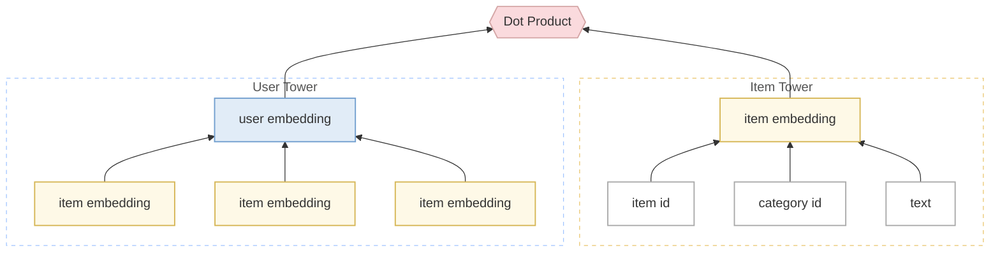

本記事は、2026/01/20 に開催した Strategic Search & Recommendation Meetup #3 にて発表した内容を元に執筆しています。

https://dmm.connpass.com/event/379601/

## はじめに

データ活用推進部 データサイエンスグループ レコメンドチームの寺井です。

DMM TV は、20万本以上の多様なコンテンツを提供する総合動画配信サービスであり、膨大な作品群の中からユーザにとっておすすめの作品を届けるため、日々レコメンドエンジンの最適化に取り組んでいます。

DMM TV のレコメンドにおいてもっとも重要な導線のひとつが、Top ページ上部に位置する u2i 棚（「あなたにおすすめの作品」棚）です。


*u2i 棚*

ほぼ全てのユーザが目にするこの棚には、従来から Two-Tower モデルをベースとしたレコメンドエンジンを採用してきました。このレコメンドエンジンを本記事では、Alpha Engine と仮称します。

この Alpha Engine における Two-Tower モデルは、ユーザの行動履歴から生成した User Embedding と、作品のメタデータから生成した Item Embedding の近傍探索によって、パーソナライズされた結果を提示するものです。



## 課題

あるとき、従来の Alpha Engine とは全く異なるロジックを持つ Beta Engine （仮称）を導入しました。

A/B テストの結果、「u2i 棚経由の視聴時間」は大幅に増加している一方で、「サービス全体の総視聴時間」を見ると、2.56% の微増にとどまり、統計的な有意差も確認できませんでした。

A/B テストの結果分析から、以下のような課題が見えてきました。

- Beta Engine は、検索や他の棚でどのみち視聴されるはずだった作品を u2i 棚に提示することで数字を奪っている傾向が見られる。特定の棚の数値が良く見えているだけで、サービス全体としての視聴純増への寄与は小さかった。


この特定の棚の数値が良く見えるだけの「指標ハック」を脱却し、**レコメンドによってのみ発生しうる視聴**を新規獲得することを目指し、Alpha Engine の高度化、すなわち Alpha' Engine の開発に着手しました。

Beta Engine ではなく、Alpha Engine を改善することにしたのは、コストや開発速度の観点でメリットが大きいと判断したためです。特にコストに関して、Beta Engine は運用コストが膨れ上がっていて、同等以上の性能でコストを下げることができると嬉しいという背景もありました。

## 取り組んだ内容

### ボトルネックの特定

Alpha Engine と Beta Engine の差分を確認するために、Beta Engine を導入したときの A/B テストの結果分析を実施しました。

「サービス全体の総視聴時間」に至るまでの経路別に分解してみた結果が下の図になります。


*各経路別の A/B テスト結果 (Alpha Engine/Beta Engine)*

Alpha Engine は「視聴の有無」を label に学習しているため u2i watch/click （＝ u2i 経由の視聴開始率） のみ勝っていました。
一方で、**他の行動（u2i imp, u2i click、u2i 経由視聴時間）を組み合わせてバランス良く最適化できていなかった**ことがわかりました。

### オフライン評価の実装

A/B テストを再度実施する前に、施策の確度を高めることを目的として、オフライン評価環境を構築しました。

#### 評価手法

評価には **DR (= Doubly Robust) 推定量**を用い、各方策の期待報酬を推定したうえで pairwise に比較しました。

DR 推定量は以下の2つの手法を組み合わせたオフポリシー評価手法です。

- IPS (= Inverse Propensity Scoring)
  - 傾向スコア (= Propensity Score) を用いて観測データを重み付けすることで、方策の違いによる分布のずれを補正する手法。
  - 傾向スコアとは「その状況（ユーザ・文脈）で、そのアイテムが実際に提示された確率」を意味します。例えば、あるアイテムをほとんど表示しないロギング方策において、そのアイテムを高頻度で表示する評価対象の方策では、傾向スコアは非常に小さくなります。このような場合、推定量の分散が大きくなるという問題があります。
- DM (= Direct Method)
  - 未観測の報酬を機械学習モデル（GBR, MLP 等）で予測して補完する手法。
  - 報酬予測モデルの精度に依存するため、単体ではバイアスが残りやすいという問題があります。

DR 推定量はこの両者を組み合わせることで、「傾向スコアが正しく推定されている」もしくは「報酬予測モデルが正しい」のどちらか一方が成り立てば一致推定量となる（二重頑健性）という性質を持ちます。

これにより、IPS 単体よりも分散が抑えられ、DM 単体よりもバイアスに強い推定が可能となり、オフライン評価の信頼性を高めています。

#### 報酬設計

クリックベイトを抑制し、質の高い視聴を促すために、以下の報酬関数を独自に定義しました。

```
reward = view + 4 * watch + log(play_duration + 1)
```

| 変数 | 説明 |
|---|---|
| `view` | 末端閲覧の有無（0 or 1） |
| `watch` | 視聴の有無（0 or 1） |
| `play_duration` | 視聴時間（分） |

`watch` に4倍の重みを掛けることで、単なる閲覧よりも実際の視聴開始を重視しています。また、`log` で視聴時間を対数変換することで、長時間視聴による報酬の過大評価を抑えつつ、視聴時間の長さを適切に反映しています。

さらに、5分以下の短い視聴に対しては `reward = -5` のペナルティを課しています。これは、サムネイルやタイトルに釣られてクリックしたものの、すぐに離脱してしまうような「クリックベイト的な視聴」を抑制するための設計です。

以下に報酬の具体例を示します。

| ケース | reward |
|---|---|
| 末端閲覧のみ | `1 + 0 + 0 = 1` |
| 末端閲覧後に10分間視聴 | `1 + 4×1 + log(10+1) ≈ 7.40` |
| 末端閲覧後に3分間視聴（ペナルティ適用） | `-5` |

このように、短時間の離脱視聴には明確なペナルティを設けることで、視聴時間まで見据えた質の高いレコメンドを評価する仕組みとしています。

### ボトルネックを狙い撃ちするモデル改善

分析で見えてきたボトルネックを解消するため、以下の3つの改善を実施しました。

#### 1. Multi-task 学習

u2i watch/click （＝ u2i 経由の視聴開始率）のみ勝っている状態を改善するため、「視聴の有無」の2値のラベルの他に「末端閲覧の有無」と「視聴時間」も併せ、バランスよく最適化しました。
具体的には、末端閲覧履歴と視聴履歴を用いて、Sampling Weight で重み付けする形で学習・推論するようにしました。

重み付けの値は、先のオフライン評価の報酬設計と同じにしています。

```
weight = view + 4 * watch + log(play_duration + 1)
```

#### 2. Positional Embedding への刷新

従来は User Embedding に Day Embedding として日付情報をもたせていました。
しかし、これによって直近日付に紐づく行動が強く評価され、結果的に最新クールのアニメが優遇されやすくなっていました。
これを、ユーザ単位の行動の「時系列上の位置」を表現する Positional Embedding へ置き換えることで、単なる新しさだけでなく、行動の文脈や順序に基づいて行動を評価できるようにしました。

#### 3. Item Embedding の多層化

従来はアイテム特徴量 Embedding を平均して ItemEmbedding としていました。
これを、各アイテム特徴量 Embedding を concat した後に、3層 MLP を通す構成に変更することで、アイテム特徴量間の複雑な相互作用を捉えられるようにしました。

## 効果検証

### オフライン評価（定量評価）

構築したオフライン評価環境を用いて、Alpha' Engine と Alpha Engine のレコメンド結果を pairwise で比較しました。評価対象期間は、49日間としました。

なお、Beta Engine はレコメンド結果のデータ取得に技術的な制約があるため、ここでは Alpha Engine との比較をしています。

その結果、Alpha' Engine は Alpha Engine に対して有意な改善を記録しました。


*オフライン評価結果*

### オフライン評価（定性評価）

定量評価に加え、レコメンド結果の妥当性を確認するために定性評価も実施しました。具体的には、ユーザに紐づく行動履歴と新旧エンジン（Alpha' Engine, Alpha Engine）のレコメンド結果を目視で比較しました。

評価には、以下のような視聴傾向を持つユーザを対象としました。

- アニメ視聴ユーザ
- 2.5次元舞台視聴ユーザ
- 邦画視聴ユーザ
- 新規ユーザ

定性評価を通じて、以下の傾向が確認できました。

- 話数の多い（少年漫画系の）作品がレコメンドに出やすくなった: これは「1. Multi-task 学習」による改善効果と考えられます。視聴時間を報酬に組み込んだことで、長く視聴される傾向のある作品が適切に評価されるようになりました。
- 最新クールのアニメがわずかに出にくくなった: これは「2. Positional Embedding への刷新」による改善効果と考えられます。日付の新しさに引きずられる傾向が緩和され、ユーザの行動文脈に基づいたレコメンドが行われるようになりました。

いずれもモデル改善の意図と合致する変化であり、定量・定性の両面から Alpha' Engine の改善効果を確認できました。

### A/B テスト

オフライン評価で有意な改善を確認できたため、A/A テストによる検定を経て、14日間の A/B テストを実施しました。

**改善後の A/B テスト結果（Alpha' Engine / Beta Engine）**

| 指標 | 差分 (%) | p 値 | 結果 |
|---|---|---|---|
| サービス全体の総視聴時間 | -1.03% | 0.76 | 有意差なし（引き分け） |
| u2i 経由の視聴時間 | -27.3% | 0.00 | 有意差あり（負け） |

**参考: 改善前の A/B テスト結果（Alpha Engine / Beta Engine）**

| 指標 | 差分 (%) | p 値 | 結果 |
|---|---|---|---|
| サービス全体の総視聴時間 | -2.50% | 0.15 | 有意差なし（劣勢） |
| u2i 経由の視聴時間 | -59.9% | 0.00 | 有意差あり（負け） |

#### 考察

「サービス全体の総視聴時間」で同等の貢献を実現できています。

改善前後を比較すると、Alpha Engine のボトルネックであった単一 label（視聴の有無のみ）の最適化を解消し、各経路でバランス良く最適化できるようになったことが読み取れます。具体的には、u2i 経由の視聴時間の差分が **-59.9% → -27.3%** へと大幅に縮小しており、サービス全体の総視聴時間も **-2.50%（劣勢）→ -1.03%（引き分け）** へと改善しました。


*各経路別の A/B テスト結果 (Alpha' Engine / Beta Engine)*

一方で、Alpha Engine に対して「u2i 経由の視聴時間」は増加傾向にあるものの、「サービス全体の総視聴時間」の純増には至っていないため、こちらは今後の課題としたいと考えています。ただし、Beta Engine と比較して他経路からの視聴を奪っていない傾向は確認できており、「指標ハック」ではない改善であると評価しています。

運用コストが膨れ上がっていた Beta Engine に対し、既存エンジンのチューニングで同等の成果を出せたことは、コストや開発速度の観点からも大きな成果でした。

## まとめ

今回の取り組みでは、u2i 棚の数値改善が他経路からの視聴を奪うことで実現されていた「指標ハック」の状態を課題として捉え、サービス全体の価値向上を目指した最適化プロセスを実践しました。

その結果、「サービス全体の総視聴時間」を維持しつつ、他経路からの視聴を奪わない形で u2i 棚とそれ以外の導線が適切に棲み分けできるモデルを実現できました。これは、u2i 棚でしか出会えないような作品をレコメンドすることで、**特定の棚の数字を追う「指標ハック」から、サービス全体への「事業貢献」へと視点を移すことができた成果**だと考えています。


## 今後の展望

今後は、さらに一歩踏み込んだ改善をしていきたいです。

- **カニバリの直接抑制**: 「他経路で視聴が発生するか」の予測スコアを別途算出し、weight として加味することで、他経路との視聴の奪い合いを直接的に抑制。また、ユーザが視聴したことのないジャンルの作品を優遇することで、u2i 棚ならではのセレンディピティのあるレコメンドを目指していきたいです。
- **ユーザセグメント別の最適化**: 「無料期間会員」「有料会員」「退会済み会員」では重視すべき KPI が異なります。例えば、無料期間会員には有料転換を促す作品を、退会済み会員には再登録の動機となる作品を優先するなど、セグメントごとに最適化の方針を出し分けることを検討していきたいです。
- **KPI の再定義**: KGI に対する各特徴量（KPI 候補）の多変量解析をした結果、今回指標として用いていた「サービス全体の総視聴時間」は KGI への寄与がそこまで大きくないことがわかってきました。より有効な指標を特定し、それに基づいたモデル改善を進めていきたいです。

## おわりに

DMM では、Strategic Search & Recommendation Meetup 勉強会を定期的に開催しています。
検索・レコメンドにおける KGI/KPI 設計、事業貢献戦略、評価設計（オフライン/オンラインテスト）といったテーマに関する、実践的な情報や事例の共有を目的とした勉強会です。

本記事に関心を持っていただけた方は、ぜひ次回以降のイベントにもご参加いただけますと幸いです。

また、過去の資料も公開していますので、こちらもぜひご覧ください。


https://zenn.dev/dmmdata/articles/bc1a7f4c6d848f
https://zenn.dev/dmmdata/articles/a7e0bc517f356d
https://zenn.dev/dmmdata/articles/70abd3a436eb56
