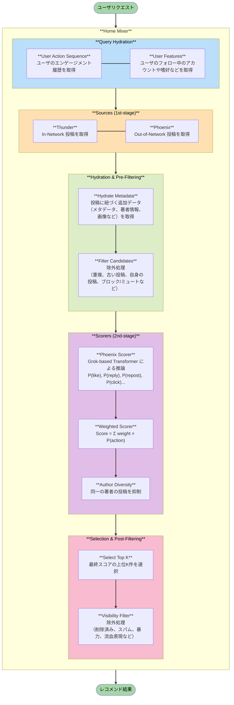

## はじめに

2026年1月、X のレコメンドアルゴリズムが公開されました。

https://github.com/xai-org/x-algorithm

以前にも、（Twitter と呼ばれていた頃の）レコメンドアルゴリズム[^1]が公開されていましたが、今回は現時点での最新版のロジックとなっています。

この記事では、公開されたコードを読んで以下の点について理解を深めようと思います。

- X のレコメンドシステム全体のアーキテクチャ
- 候補生成とランキングの2段階構成の実装
    - Two-Tower モデルによる高速な候補検索の仕組み
    - Grok-based Transformer を用いたランキングモデルの詳細
- リアルタイム推論を実現するための工夫


## 概観

2-stage レコメンドシステムの構成をとっており、次のようになっています。

- 1st stage: 候補生成
  - 以下の2つの経路からユーザが興味を持ちそうな候補アイテムを高速に絞り込む
    - フォロー中のアカウントの投稿 (In-Network) をインメモリで取得
    - フォロー外のアカウントの投稿 (Out-of-Network) からユーザが興味を持ちそうなものを Two-Tower モデルにより高速に検索
- 2nd stage: ランキング
  - ユーザと候補アイテムのペアに対して、Grok-based Transformer を用いた Ranking モデルで（複数種類の）エンゲージメント発生確率を予測し、重み付け合成したものをスコアとする

2-stage に分けている理由としては、ユーザに対して全アイテムをスコアリングするのは計算コストが高すぎるためです。まずは軽量かつ高速なロジックで候補アイテムを数百～数千件程度に絞り込んでから、スコアリングを行うのがレコメンドシステムにおける一般的な構成となります。


*2-stage レコメンドシステムの一般的な構成図[^2]*


### 処理の流れ

X のレコメンドシステムが、ユーザリクエストを受けてからレコメンド結果を返すまでの処理の流れは、次のようになっています。



### 主要コンポーネント

主に次の4つのコンポーネントで構成されています。
1. `Home Mixer`: パイプライン全体をオーケストレーション
2. `Candidate Pipeline`: パイプラインの各コンポーネントをインターフェースとして提供（Rust で抽象化）
3. `Thunder`: フォロー中のアカウントの投稿 (In-Network) をインメモリで返す
4. `Phoenix`: フォロー外のアカウントの投稿 (Out-of-Network) からユーザが興味を持ちそうなものを Two-Tower モデルにより高速に検索。また、Grok-based Transformer を用いた Ranking モデルでスコアリングも行う。

ここからはコンポーネント毎に、実装を見ていきます。

## 1. Home Mixer

Home Mixer は、上述したすべての処理をオーケストレーションしています。

サービス構成としては、Home Mixer の複数インスタンスがロードバランサーの背後で（？）動いており、各インスタンスが Thunder や Phoenix などのバックエンドサービスと gRPC で通信する形になっています。

```
┌────────┐ ┌────────┐
│ Home   │ │ Home   │
│ Mixer 1│ │ Mixer 2│  ... N 個のインスタンス
└───┬────┘ └──┬─────┘
    │         │
    └────┬────┘
         │
    ┌────▼────────────────────────┐
    │  Backend Services (gRPC)    │
    ├─────────────────────────────┤
    │ Thunder | Phoenix | TES     │
    │ Gizmoduck | VF | UAS        │
    │ Strato                      │
    └─────────────────────────────┘
```

## 2. Candidate Pipeline

Home Mixer のパイプラインは、Candidate Pipeline という枠組みで動いています。
Candidate Pipeline では、各処理を以下のように Trait で抽象化し、インターフェースとして提供しています。

```rust
trait QueryHydrator<Q> {
    async fn hydrate(&self, query: &mut Q) -> anyhow::Result<()>;
}

trait Source<Q, C> {
    async fn fetch(&self, query: &Q) -> anyhow::Result<Vec<C>>;
}

trait Hydrator<Q, C> {
    async fn hydrate(&self, query: &Q, candidates: &mut [C]) -> anyhow::Result<()>;
}

trait Filter<Q, C> {
    fn filter(&self, query: &Q, candidates: &mut Vec<C>) -> anyhow::Result<()>;
}

trait Scorer<Q, C> {
    fn score(&self, query: &Q, candidates: &mut [C]) -> anyhow::Result<()>;
}

trait Selector<C> {
    fn select(&self, candidates: Vec<C>) -> Vec<C>;
}

trait SideEffect<Q, C> {
    async fn execute(&self, query: &Q, selected: &[C]);
}
```

この抽象があると、実装側は「どの段階の責務なのか」を意識しやすいです。
個人的には、ロジックとパイプライン運用をちゃんと分離できるのが嬉しいポイントだと思いました。

また、Candidate Pipeline は「並列にできるところは並列、依存があるところは逐次」という思想です。
たとえば、Filter や Scorer は前の結果を前提に次を適用することがあるので、むやみに並列化していません。

## 3. Thunder

Thunder は、フォローしているアカウントの投稿 (In-Network) を高速に返すためのコンポーネントです。
インメモリストアとリアルタイム Kafka インジェストパイプラインを組み合わせ、低レイテンシで投稿候補を提供します。

### PostStore

Thunder の中心はインメモリの `PostStore` です。
投稿本体は `post_id -> LightPost` で持ちつつ、ユーザごとのタイムライン用に軽量な参照（`TinyPost`）を別インデックスで持っています。

```rust
pub struct PostStore {
    // post_id でインデックスされた完全な投稿データ
    posts: Arc<DashMap<i64, LightPost>>,

    // ユーザごとの投稿タイムライン（投稿タイプ別）
    original_posts_by_user: Arc<DashMap<i64, VecDeque<TinyPost>>>,    // 通常
    secondary_posts_by_user: Arc<DashMap<i64, VecDeque<TinyPost>>>,   // リプライとリツイート
    video_posts_by_user: Arc<DashMap<i64, VecDeque<TinyPost>>>,       // 動画のみ

    // 削除済み投稿の追跡
    deleted_posts: Arc<DashMap<i64, bool>>,

    // 設定
    retention_seconds: u64,          // 投稿保持期間
    request_timeout: Duration,       // リクエストタイムアウト
}
```

以下のような工夫をしていることがわかります。
- 投稿本体の重複保持を避けてメモリ効率を上げる
- 取得パターン（通常 / リプライとリツイート / 動画のみ）ごとにインデックスを分けて高速化する

### Kafka インジェスト

Thunder は Kafka から投稿イベントを取り込みます。

インメモリで全件持つとメモリが膨れるので、保持期間（デフォルト2日など）を超えた投稿を定期的に削除して、メモリを一定に保つ設計になっています。

## 4. Phoenix

Phoenix は、1st-stage（候補生成）で用いる Two-Tower モデルと 2nd-stage（ランキング）で用いる Grok-based Transformer モデルを提供する ML コンポーネントです。

:::message
公開リポジトリには、推論コードのみが含まれており、学習コードは含まれていませんでした。
詳細な目的関数や NegativeSampling 手法などがわからないので残念。。。
:::


### Two-Tower モデル

Two-Tower モデルは、ユーザと候補アイテムを別々の Tower（エンコーダ）でベクトル化し、Dot Product で類似度を計算するアーキテクチャです。

このアーキテクチャの利点は、ユーザベクトルと候補ベクトルを独立に計算できる点にあります。
候補ベクトルは事前にオフラインで全投稿に対して計算しておき、ANN（近似最近傍探索）インデックスに格納しておくことで、推論時には以下の流れで高速に候補を取得できます。

1. リクエスト時にユーザベクトルのみをオンラインで計算
2. ANN インデックスで類似度の高い候補を高速検索
3. Top-K 件の候補を返す

詳しくは、Google Cloud のブログ記事[^2]などを参照してください。

X の実装については、次のようになっています。

```
                            PHOENIX RETRIEVAL MODEL
    ┌────────────────────────────────────────────────────────────────────────────┐
    │                                                                            │
    │                         TOP-K SELECTION (ANN)                              │
    │                                                                            │
    │                                    │                                       │
    │                                    ▲                                       │
    │                                    │                                       │
    │                    ┌───────────────┴───────────────┐                       │
    │                    │                               │                       │
    │                    │    Dot Product Similarity     │                       │
    │                    │                               │                       │
    │                    └───────────────┬───────────────┘                       │
    │                                    │                                       │
    │                    ┌───────────────┴───────────────┐                       │
    │                    │                               │                       │
    │                    ▼                               ▼                       │
    │          ┌──────────────────────┐     ┌──────────────────────┐             │
    │          │   User Vector [D]    │     │ Candidate Vector [D] │             │
    │          │                      │     │                      │             │
    │          │  L2 Normalization    │     │  L2 Normalization    │             │
    │          │          ↑           │     │          ↑           │             │
    │          │  Mean Pooling        │     │  2-Layer MLP + SiLU  │             │
    │          │          ↑           │     │          ↑           │             │
    │          │ Transformer Encoding │     │    Concatenate       │             │
    │          │          ↑           │     │          ↑           │             │
    │          │  User + History      │     │  Post + Author       │             │
    │          │                      │     │                      │             │
    │          └──────────────────────┘     └──────────────────────┘             │
    │               User Tower                   Candidate Tower                 │
    │           (Transformer-based)                (MLP-based)                   │
    │                                                                            │
    └────────────────────────────────────────────────────────────────────────────┘
```

User Tower では時系列の履歴を扱うため Transformer を使い、Candidate Tower では投稿単体の特徴量を扱うため軽量な MLP を使っていることがわかります。

### Ranking モデル

絞り込んだ候補に対して、Grok-based Transformer を用いたモデルで複数のエンゲージメント発生確率を予測します。

```
                              PHOENIX RANKING MODEL
    ┌────────────────────────────────────────────────────────────────────────────┐
    │                                                                            │
    │                              OUTPUT LOGITS                                 │
    │                        [B, num_candidates, num_actions]                    │
    │                                    │                                       │
    │                                    │ Unembedding                           │
    │                                    │ Projection                            │
    │                                    │                                       │
    │                    ┌───────────────┴───────────────┐                       │
    │                    │                               │                       │
    │                    │    Extract Candidate Outputs  │                       │
    │                    │    (positions after history)  │                       │
    │                    │                               │                       │
    │                    └───────────────┬───────────────┘                       │
    │                                    │                                       │
    │                    ┌───────────────┴───────────────┐                       │
    │                    │                               │                       │
    │                    │         Transformer           │                       │
    │                    │     (with special masking)    │                       │
    │                    │                               │                       │
    │                    │   Candidates CANNOT attend    │                       │
    │                    │   to each other               │                       │
    │                    │                               │                       │
    │                    └───────────────┬───────────────┘                       │
    │                                    │                                       │
    │    ┌───────────────────────────────┼───────────────────────────────┐       │
    │    │                               │                               │       │
    │    ▼                               ▼                               ▼       │
    │ ┌──────────┐              ┌─────────────────┐              ┌────────────┐  │
    │ │   User   │              │     History     │              │ Candidates │  │
    │ │Embedding │              │   Embeddings    │              │ Embeddings │  │
    │ │  [B, 1]  │              │    [B, S, D]    │              │  [B, C, D] │  │
    │ │          │              │                 │              │            │  │
    │ │ User     │              │ Posts + Authors │              │ Posts +    │  │
    │ │ Hashes   │              │ + Actions +     │              │ Authors +  │  │
    │ │          │              │ Product Surface │              │ Product    │  │
    │ └──────────┘              └─────────────────┘              │ Surface    │  │
    │                                                            └────────────┘  │
    │                                                                            │
    └────────────────────────────────────────────────────────────────────────────┘
```

予測するエンゲージメントの種類は、以下のように多岐にわたります。

```python
ACTIONS = [
    "favorite_score",           # いいね確率
    "reply_score",              # リプライ確率
    "repost_score",             # リポスト確率
    "photo_expand_score",       # 画像展開確率
    "click_score",              # クリック確率
    "profile_click_score",      # プロフィールクリック確率
    "vqv_score",                # 動画視聴品質スコア
    "share_score",              # シェア確率
    "share_via_dm_score",       # DM 共有確率
    "share_via_copy_link_score",# リンクコピー確率
    "dwell_score",              # 滞在確率
    "quote_score",              # 引用ツイート確率
    "quoted_click_score",       # 引用ツイートクリック確率
    "follow_author_score",      # 著者フォロー確率
    "not_interested_score",     # 興味なし確率（ネガティブ）
    "block_author_score",       # 著者ブロック確率（ネガティブ）
    "mute_author_score",        # 著者ミュート確率（ネガティブ）
    "report_score",             # 報告確率（ネガティブ）
    "dwell_time",               # 滞在時間
]
```

### 技術的な工夫

技術的な工夫としては、以下のようなものが見られます。
- Grok-based Transformer
- 候補分離 Attention
- ハッシュベース埋め込み

#### Grok-based Transformer

2017年に提案されたオリジナルの Transformer から、近年の LLM で用いられているような要素で update された Grok-based Transformer を使っています。

これによって、学習の安定性や計算効率の向上が図られています。

| 要素 |（オリジナル）Transformer | Grok-based Transformer |
|-----------------------|-----------------------|-----------------------|
| Normalization | LayerNorm | RMSNorm |
| 活性化関数 | FFN | SwiGLU |
| 位置エンコーディング | Sinusoidal Absolute PE | RoPE |
| KV sharing | なし | あり（Grouped-Query） |

コードを見た限り、Mixture-of-Experts (MoE) や超長コンテキストのサポートなど、近年の LLM で見られるような他の要素はありませんでした。

https://github.com/xai-org/x-algorithm/blob/main/phoenix/grok.py

#### 候補分離 Attention

Transformer で複数候補をまとめて処理すると、候補同士が Attention で影響し合うことがあります。
すると「一緒に推論した相手次第でスコアが変わる」ことが起き得ます。

```python: 問題点のイメージ
# 入力: [User, History, Candidate1, Candidate2, Candidate3]
# 通常のCausal Attention:

        Keys: U  H1  H2  C1  C2  C3
Query C1:    ✓   ✓   ✓   ✓   ✗   ✗   ← C1 が C1 自身に注目
Query C2:    ✓   ✓   ✓   ✓   ✓   ✗   ← C2 が C1 と C2 に注目
Query C3:    ✓   ✓   ✓   ✓   ✓   ✓   ← C3 が C1, C2, C3 に注目
```

Phoenix はこれを避けるために、候補同士の Attention に mask を入れることで他の候補からの影響を排除しています。

```python: 解決策のイメージ
# 入力: [User, History, Candidate1, Candidate2, Candidate3]
# 通常のCausal Attention:

        Keys: U  H1  H2  C1  C2  C3
Query C1:    ✓   ✓   ✓   ✓   ✗   ✗   ← C1 が C1 自身に注目
Query C2:    ✓   ✓   ✓   ✗   ✓   ✗   ← C2 が C2 自身に注目
Query C3:    ✓   ✓   ✓   ✗   ✗   ✓   ← C3 が C3 自身に注目
```

https://github.com/xai-org/x-algorithm/blob/main/phoenix/grok.py#L39-L71

#### ハッシュベース埋め込み

ユーザ ID や投稿 ID のような巨大 ID 空間に対して、素直に Embedding テーブルを持つとメモリが厳しくなります。
Phoenix は複数ハッシュで小さなテーブルに写像し、平均化して衝突を緩和しています。

https://github.com/xai-org/x-algorithm/blob/main/phoenix/recsys_model.py#L79-L242

## おわりに

### システム面
X のレコメンドシステムはリアルタイム推論でのレイテンシを抑えるための工夫が随所に見られて、勉強になりました。
弊チームでもニアリアルタイム推論のレコメンドシステム[^3]を一部運用しているのですが、リアルタイム推論になってくるとレイテンシに対する要求が高くなることがわかりました。

### ロジック面
Transformer を用いてユーザ行動履歴をエンコードするのは、最近のレコメンドシステムでよく見かける気がします。時系列を Transformer でエンコードすることで、ユーザの嗜好の時間的変化を捉えやすくなりますし、候補アイテムとの複雑な相互作用もモデリングしやすくなるからかなと思います。また、近年の LLM (Transformer) の盛り上がりの影響もありそうです。

個人的に、今の X のレコメンドアルゴリズムは全体で人気な投稿がレコメンドされやすいと思っていて、（以前の SimClusters[^4] のような）フォロー・フォロワー関係のグラフ構造から Out-of-Network の候補を作っていく方向にしてほしいなと思っています。

## 参考文献

https://github.com/xai-org/x-algorithm
https://zenn.dev/shot4410/articles/5354ce65907e15
https://medium.com/thedeephub/positional-encoding-explained-a-deep-dive-into-transformer-pe-65cfe8cfe10b
https://www.ibm.com/jp-ja/think/topics/grouped-query-attention

[^1]: the-algorithm: https://github.com/twitter/the-algorithm
[^2]: Scaling deep retrieval with TensorFlow Recommenders and Vertex AI Matching Engine: https://cloud.google.com/blog/products/ai-machine-learning/scaling-deep-retrieval-tensorflow-two-towers-architecture
[^3]: BigQueryの継続的クエリで作るニアリアルタイムレコメンド: https://note.com/fmlryu/n/nbbe6cc152e26
[^4]: SimClusters v2: https://github.com/twitter/the-algorithm/blob/main/src/scala/com/twitter/simclusters_v2
