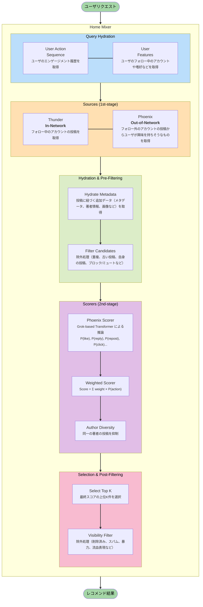

## はじめに

X のレコメンドアルゴリズムが公開されました。

https://github.com/xai-org/x-algorithm

以前にも、[（Twitter と呼ばれていた頃の）レコメンドアルゴリズム](https://github.com/twitter/the-algorithm)が公開されていましたが、今回は現時点での最新版のロジックとなっています。


## 概観

2-stage レコメンドシステム[^1]の構成をとっており、次のようになっています。

- 1st stage: 候補生成
  - 以下の2つの経路からユーザが興味を持ちそうな候補アイテムを高速に絞り込む
    - フォロー中のアカウントの投稿 (In-Network) をインメモリで取得
    - フォロー外のアカウントの投稿 (Out-of-Network) からユーザが興味を持ちそうなものを Two-Tower モデルにより高速に検索
- 2nd stage: ランキング
  - ユーザと候補アイテムのペアに対して、Grok-based Transformer モデルで（複数種類の）エンゲージメント発生確率を予測し、重み付け合成したものをスコアとする

2-stage に分けている理由としては、ユーザに対して全アイテムをスコアリングするのは計算コストが高すぎるためです。まずは軽量かつ高速なロジックで候補アイテムを数百件から数千件程度に絞り込んでから、スコアリング（≒ ランキング）を行うのがレコメンドシステムにおける一般的な構成となります。


*2-stage レコメンドシステムの一般的な構成図*


### 主要コンポーネント

X のレコメンドシステムは、主に次の4つのコンポーネントで構成されています。
- `Home Mixer`: パイプライン全体をオーケストレーション
- `Candidate Pipeline`: パイプラインの各コンポーネントをインターフェースとして提供（Rust で抽象化）
- `Thunder`: フォロー中のアカウントの投稿 (In-Network) をインメモリで返す
- `Phoenix`: フォロー外のアカウントの投稿 (Out-of-Network) からユーザが興味を持ちそうなものを Two-Tower モデルにより高速に検索。また、Grok-based Transformer モデルでスコアリングも行う。

### 処理の流れ

X のレコメンドシステムがユーザリクエストを受けてからレコメンド結果を返すまでの処理の流れは、次のようになっています。



ここからは各コンポーネント毎に、実装を見ていきます。

## Home Mixer

Home Mixer は、上述したすべての処理をオーケストレーションしています。

サービス構成としては、Home Mixer の複数インスタンスがロードバランサーの背後で動いており、各インスタンスが Thunder や Phoenix などのバックエンドサービスと gRPC で通信する形になっています。

```
┌─────────────────┐
│  Load Balancer  │
└────────┬────────┘
         │
    ┌────┴────┐
    │         │
┌───▼────┐ ┌──▼─────┐
│ Home   │ │ Home   │
│ Mixer 1│ │ Mixer 2│  ... N 個のインスタンス
└───┬────┘ └──┬─────┘
    │         │
    └────┬────┘
         │
    ┌────▼────────────────────────┐
    │  Backend Services (gRPC)    │
    ├─────────────────────────────┤
    │ Thunder | Phoenix | TES     │
    │ Gizmoduck | VF | UAS        │
    │ Strato                      │
    └─────────────────────────────┘
```

## Candidate Pipeline

Home Mixer のパイプラインは、Candidate Pipeline という枠組みで動いています。
ここでは、各処理を以下のように Trait で抽象化しています。

```rust
trait QueryHydrator<Q> {
    async fn hydrate(&self, query: &mut Q) -> anyhow::Result<()>;
}

trait Source<Q, C> {
    async fn fetch(&self, query: &Q) -> anyhow::Result<Vec<C>>;
}

trait Hydrator<Q, C> {
    async fn hydrate(&self, query: &Q, candidates: &mut [C]) -> anyhow::Result<()>;
}

trait Filter<Q, C> {
    fn filter(&self, query: &Q, candidates: &mut Vec<C>) -> anyhow::Result<()>;
}

trait Scorer<Q, C> {
    fn score(&self, query: &Q, candidates: &mut [C]) -> anyhow::Result<()>;
}

trait Selector<C> {
    fn select(&self, candidates: Vec<C>) -> Vec<C>;
}

trait SideEffect<Q, C> {
    async fn execute(&self, query: &Q, selected: &[C]);
}
```

この抽象があると、実装側は「どの段階の責務なのか」を意識しやすいです。
個人的には、ロジックとパイプライン運用をちゃんと分離できるのが嬉しいポイントだと思いました。

また、Candidate Pipeline は「並列にできるところは並列、依存があるところは逐次」という思想です。
たとえば、Filter や Scorer は前の結果を前提に次を適用することがあるので、むやみに並列化していません。

## Thunder

Thunder は、フォローしているアカウントの投稿 (In-Network) を高速に返すためのコンポーネントです。
インメモリストアとリアルタイム Kafka インジェストパイプラインを組み合わせ、低レイテンシで投稿候補を提供します。

### PostStore

Thunder の中心はインメモリの `PostStore` です。
投稿本体は `post_id -> LightPost` で持ちつつ、ユーザごとのタイムライン用に軽量な参照（`TinyPost`）を別インデックスで持っています。

```rust
pub struct PostStore {
    // post_id でインデックスされた完全な投稿データ
    posts: Arc<DashMap<i64, LightPost>>,

    // ユーザごとの投稿タイムライン（投稿タイプ別）
    original_posts_by_user: Arc<DashMap<i64, VecDeque<TinyPost>>>,    // 通常
    secondary_posts_by_user: Arc<DashMap<i64, VecDeque<TinyPost>>>,   // リプライとリツイート
    video_posts_by_user: Arc<DashMap<i64, VecDeque<TinyPost>>>,       // 動画のみ

    // 削除済み投稿の追跡
    deleted_posts: Arc<DashMap<i64, bool>>,

    // 設定
    retention_seconds: u64,          // 投稿保持期間
    request_timeout: Duration,       // リクエストタイムアウト
}
```

以下のような工夫をしていることがわかります。
- 投稿本体の重複保持を避けてメモリ効率を上げる
- 取得パターン（通常 / リプライとリツイート / 動画のみ）ごとにインデックスを分けて高速化する

### Kafka インジェスト

Thunder は Kafka から投稿イベントを取り込みます。

インメモリで全件持つとメモリが膨れるので、保持期間（デフォルト2日など）を超えた投稿を定期的に削除して、メモリを一定に保つ設計になっています。

## Phoenix

Phoenix は、1st-stage（候補生成）で用いる Two-Tower モデルと 2nd-stage（ランキング）で用いる Grok-based Transformer モデルを提供する ML コンポーネントです。

:::message
公開リポジトリには、推論コードのみが含まれており、学習コードは含まれていませんでした。
詳細な目的関数や NegativeSampling 手法などがわからないので残念。。。
:::


### Two-Tower モデル


```
┌─────────────────────────┐     ┌─────────────────────────┐
│      User Tower         │     │    Candidate Tower      │
│  (Transformer-based)    │     │      (MLP-based)        │
├─────────────────────────┤     ├─────────────────────────┤
│ User + History          │     │ Post + Author           │
│        ↓                │     │        ↓                │
│ Transformer Encoding    │     │ Concatenate             │
│        ↓                │     │        ↓                │
│ Mean Pooling            │     │ 2-Layer MLP + SiLU      │
│        ↓                │     │        ↓                │
│ L2 Normalization        │     │ L2 Normalization        │
│        ↓                │     │        ↓                │
│ User Vector [D]         │     │ Candidate Vector [D]    │
└───────────┬─────────────┘     └───────────┬─────────────┘
            │                               │
            └───────────┬───────────────────┘
                        ↓
            Dot Product Similarity
                        ↓
            Top-K Selection (ANN)
```

### Grok-based Transformer モデル

絞り込んだ候補に対して、Transformer（Grokベース）で複数の行動確率を予測します。
単に「関連度1本」ではなく、複数ターゲットを同時に出すのが特徴です。

- いいね、リプライ、リポスト、クリック
- 動画の視聴品質（VQV）
- ネガティブ（not interested、ブロック、ミュート、報告）
- など

ここは「プロダクトとして何を最大化したいか」が混ざる場所なので、後段の重み付けと相性が良いです。

### 候補分離 Attention

Transformer で複数候補をまとめて処理すると、候補同士が Attention で影響し合うことがあります。
すると「一緒に推論した相手次第でスコアが変わる」ことが起き得ます。

Phoenix はこれを避けるために、候補同士の Attention をブロックする mask（＝候補分離）を入れています。

### ハッシュベース埋め込み

ユーザーIDや投稿IDのような巨大ID空間に対して、素直にEmbeddingテーブルを持つとメモリが厳しくなります。
Phoenixは複数ハッシュで小さなテーブルに写像し、平均化して衝突を緩和する方向です。


## おわりに

個人的に、今の X のレコメンドアルゴリズムは全体で人気な投稿がレコメンドされやすいと思っていて、（以前の SimGraph のような）フォロー・フォロワー関係のグラフ構造から Out-of-Network の候補を作っていく方向にしてほしいなと思っています。

## 参考文献

[^1]: https://cloud.google.com/blog/products/ai-machine-learning/scaling-deep-retrieval-tensorflow-two-towers-architecture
